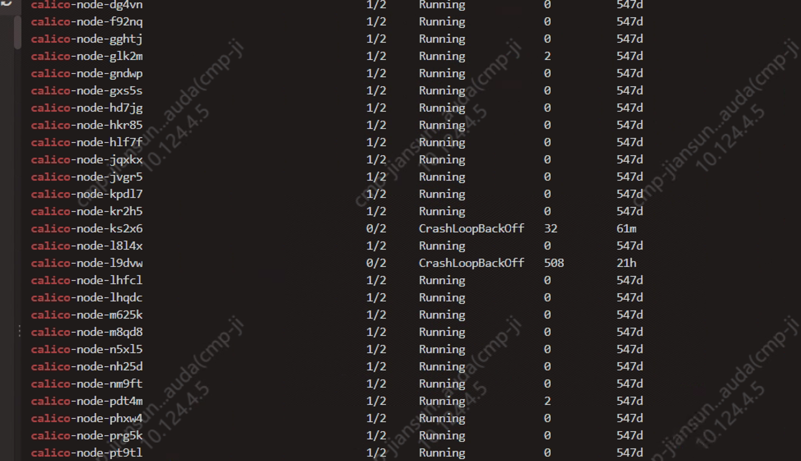
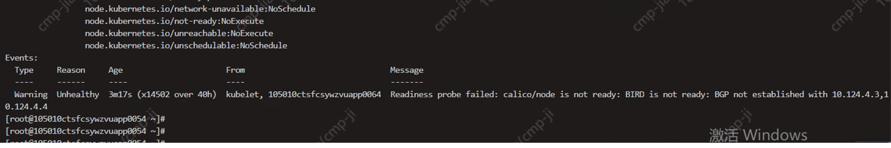
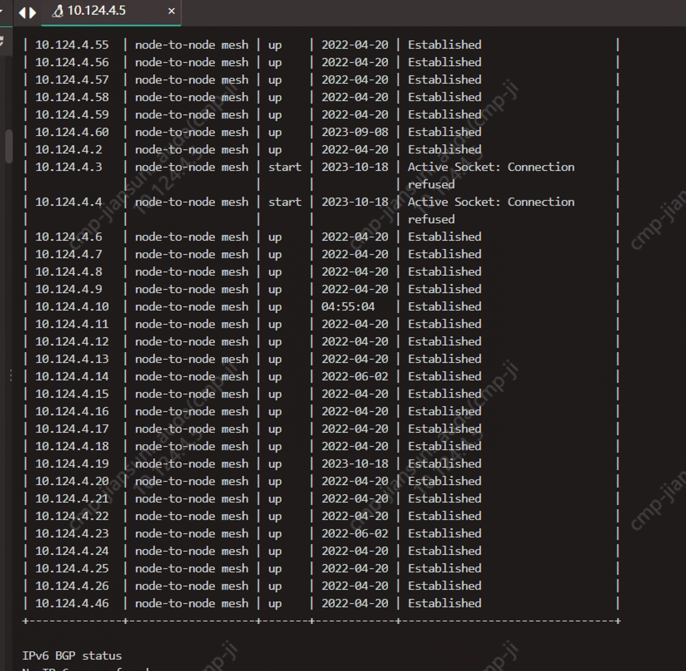
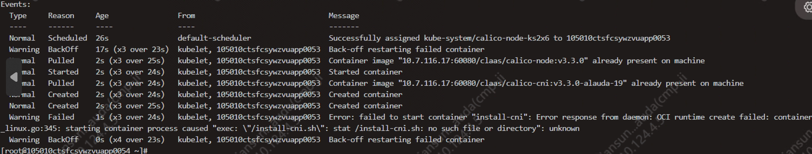
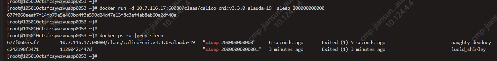
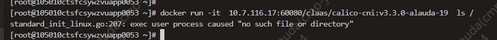

---
kind:
  - Troubleshooting
products:
  - Alauda Container Platform
  - Alauda DevOps
  - Alauda AI
  - Alauda Application Services
  - Alauda Service Mesh
  - Alauda Developer Portal
ProductsVersion:
  - 4.1.0,4.2.x
---
<!-- A type of document that involves encountering a fault, diagnosing it, performing root cause analysis, and providing solutions. -->

# 一汽

calico-node Pods处于1/2 running状态 BGP peer建立失败（10.124.4.3, 10.124.4.4） 特定节点上的calico-node处于CrashLoopBackOff

## Cause
- Docker异常

## Resolution
- 重启节点和Docker

## [workaround]

## [Related Information]
**Screenshots**

1. 先查看处于1/2 running状态的pod，describe查看发现bgp peer建立失败，10.124.4.3 10.124.4.4 刚好是处于CrashLoopBackOff状态的 calico-node， 

- Environment: ACP2.3
- calico-node
- calico-cni:v3.3.0
- Docker
- Component: Calico
- Page ID: 165015440
- Original Title: 一汽-calico-node所有Pod 不健康
