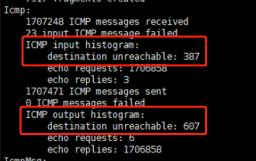
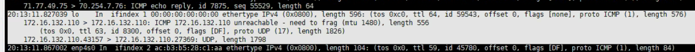

---
kind:
  - Troubleshooting
products:
  - Alauda Container Platform
  - Alauda DevOps
  - Alauda AI
  - Alauda Application Services
  - Alauda Service Mesh
  - Alauda Developer Portal
ProductsVersion:
  - 4.1.0,4.2.x
---
<!-- A type of document that involves encountering a fault, diagnosing it, performing root cause analysis, and providing solutions. -->

# UDP 偶现丢包

UDP 包中丢失第一个包 包大小超过节点 MTU 1500 tunl0 抓包缺失第一个包

## Cause
- UDP 包设置 DF flag 导致分片失败
- 触发 ICMP unreachable 错误

## Resolution
- sysctl net.ipv4.ip_no_pmtu_disc=1

## [workaround]
- 将 kube-proxy 模式切换为 iptables

## [Related Information]
**Screenshots**

- Environment: openEuler arm64, 内核 5.10, Calico v3.24, kube-proxy 原使用 ipvs 模式
- tunl0
- ipvs
- kube-proxy
- iptables
- conntrack
- net.ipv4.ip_no_pmtu_disc
- ICMP
- MTU
- Component: Calico
- Page ID: 168313442
- Original Title: UDP 偶现丢包
