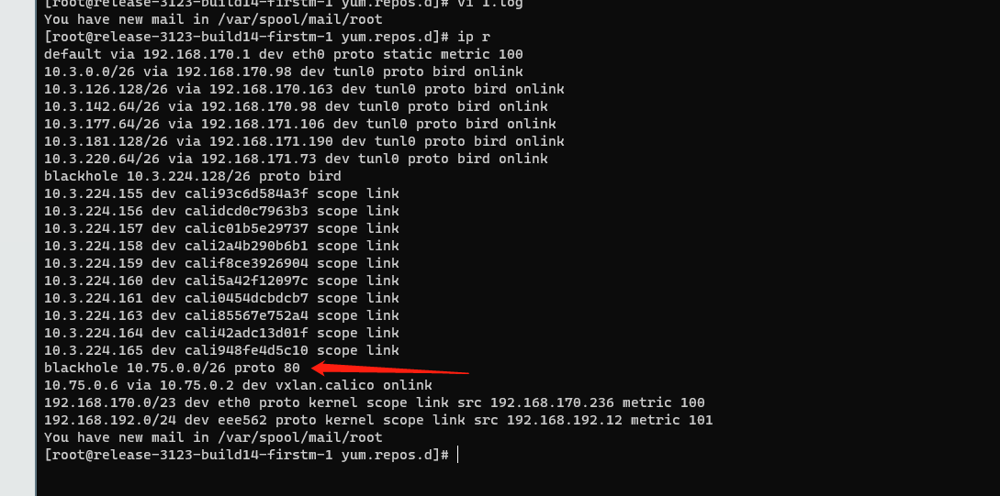

---
kind:
  - Troubleshooting
products:
  - Alauda Container Platform
  - Alauda DevOps
  - Alauda AI
  - Alauda Application Services
  - Alauda Service Mesh
  - Alauda Developer Portal
ProductsVersion:
  - 4.1.0,4.2.x
---
<!-- A type of document that involves encountering a fault, diagnosing it, performing root cause analysis, and providing solutions. -->

# calico 出现node 到pod不通

节点到Pod的ping不通 返回报文的路由不存在 手动配置的路由被calico-node自动清理

## Cause
- subnet配置的网段为/26且blocksize为26，导致整个环境只有一个ipamblock
- 每个节点的vxlan网关IP从同一个ipamblock分配，导致网关IP冲突

## Resolution
- 调整subnet网段为更大的范围（例如/16）
- 在vxlanMode: always时确保ipamblocks数量大于节点数

## [workaround]
- 临时手动修改subnet网段为更大的范围（例如/16）

## [Related Information]
**Screenshots**

- Environment: CNI 版本：3.26
- subnet配置
- ipamblocks
- vxlanMode
- calico-node组件
- 网关IP分配
- Component: Calico
- Page ID: 170363549
- Original Title: calico 出现node 到pod不通
