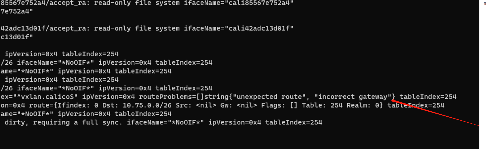

---kind:   - Troubleshootingproducts:    - Alauda Container Platform   - Alauda DevOps   - Alauda AI   - Alauda Application Services   - Alauda Service Mesh   - Alauda Developer PortalProductsVersion:   - 4.1.0,4.2.x---<!-- A type of document that involves encountering a fault, diag...it, performing root cause analysis, and providing solutions. --># calico 出现node 到pod不通节点无法ping通特定Pod 返回报文路由不存在 手动配置的路由被calico-node自动清理## Cause- subnet配置为/26且blocksize为26，导致整个环境仅有一个ipamblock- 节点间网关ip从同一ipamblock分配导致冲突## Resolution- 将subnet网段修改为/16- 确保vxlanMode: always时ipamblocks数量大于节点数## [workaround]- 手动配置回报路由（临时生效）## [Related Information]**Screenshots**- Environment: CNI 3.26- calico.vxlan- ipamblock- subnet配置- blocksize- vxlanMode: Always- Component: Calico- Page ID: 170363549- Original Title: calico 出现node 到pod不通