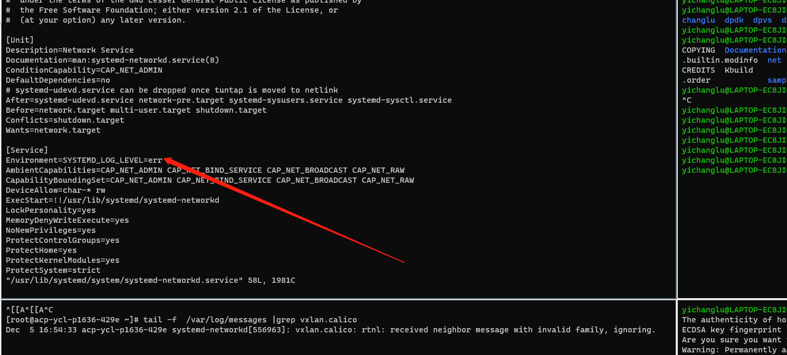

---
kind:
  - Troubleshooting
products:
  - Alauda Container Platform
  - Alauda DevOps
  - Alauda AI
  - Alauda Application Services
  - Alauda Service Mesh
  - Alauda Developer Portal
ProductsVersion:
  - 4.1.0,4.2.x
---
<!-- A type of document that involves encountering a fault, diagnosing it, performing root cause analysis, and providing solutions. -->

# 南网 calico日志打满根目录

vxlan.calico: rtnl: received neighbor message with invalid familiy, ignoring 根目录日志打满

## Cause
- systemd-networkd组件收到IPv6的nd报文后直接忽略

## Resolution
- 修改systemd-networkd的log等级到err
- 执行 systemctl daemon-reload
- 执行 systemctl restart systemd-networkd

## [workaround]

## [Related Information]
**Screenshots**

- Environment: 操作系统：麒麟；内核：4.19；双栈环境
- systemd-networkd
- vxlan.calico
- 双栈环境
- Component: Calico
- Page ID: 176264871
- Original Title: 南网 calico日志打满根目录
