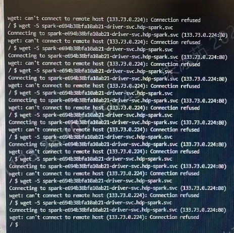
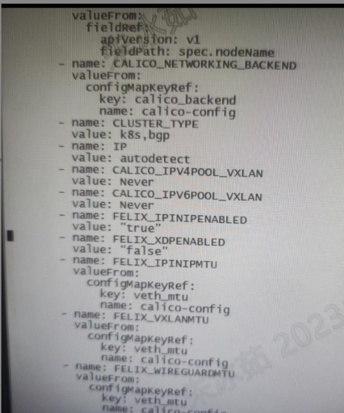

---
kind:
  - Troubleshooting
products:
  - Alauda Container Platform
  - Alauda DevOps
  - Alauda AI
  - Alauda Application Services
  - Alauda Service Mesh
  - Alauda Developer Portal
ProductsVersion:
  - 4.1.0,4.2.x
---
<!-- A type of document that involves encountering a fault, diagnosing it, performing root cause analysis, and providing solutions. -->

# 3.12.1业务集群报svc解析超时

svc解析失败，pod重启后正常

## Cause
- NetworkManager管理Calico网络接口
- FELIX_XDPENABLED启用导致XDP功能异常

## Resolution
- 创建/etc/NetworkManager/conf.d/calico.conf配置unmanaged-devices=interface-name:cali*;interface-name:tunl*;interface-name:vxlan.calico;interface-name:vxlan-v6.calico;interface-name:wireguard.cali;interface-name:wg-v6.cali
- 设置FELIX_XDPENABLED=false并重启NetworkManager: systemctl restart NetworkManager

## [workaround]

## [Related Information]
**Screenshots**

- Environment: 使用NetworkManager管理网络的Calico集群环境
- cali*
- tunl*
- vxlan.calico
- /etc/NetworkManager/conf.d/
- FELIX_XDPENABLED
- Component: Calico
- Page ID: 178228511
- Original Title: 3.12.1业务集群报svc解析超时
