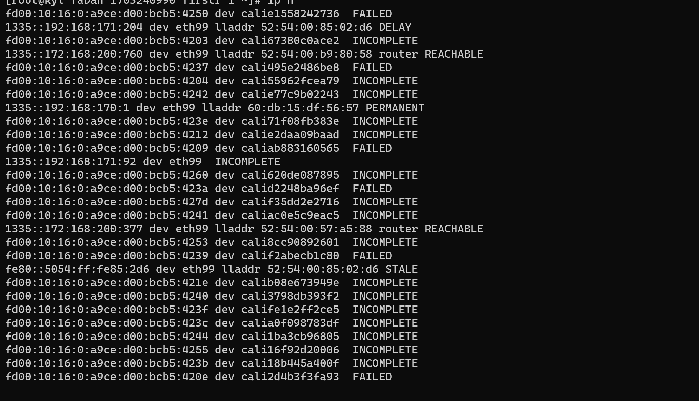

---
kind:
  - Troubleshooting
products:
  - Alauda Container Platform
  - Alauda DevOps
  - Alauda AI
  - Alauda Application Services
  - Alauda Service Mesh
  - Alauda Developer Portal
ProductsVersion:
  - 4.1.0,4.2.x
---
<!-- A type of document that involves encountering a fault, diagnosing it, performing root cause analysis, and providing solutions. -->

# 测试发版第7轮arm ipv6单栈环境出现nd异常

节点网络不通 ipv6的ip nd处于incomplete状态

## Cause
- net.ipv6.route.max_size参数默认值4096不足

## Resolution
- 执行sysctl net.ipv6.route.max_size=16384

## [workaround]
- 重启节点
- 临时禁止Pod调度到问题节点

## [Related Information]
**Screenshots**

- Environment: 麒麟arm系统 4.19.90-11.ky10.aarch64内核，ACP 3.15.0
- calico
- ipv6.neigh
- ipv6.route
- net.ipv6.route.max_size
- Component: Calico
- Page ID: 179603734
- Original Title: 测试发版第7轮arm ipv6单栈环境出现nd异常
