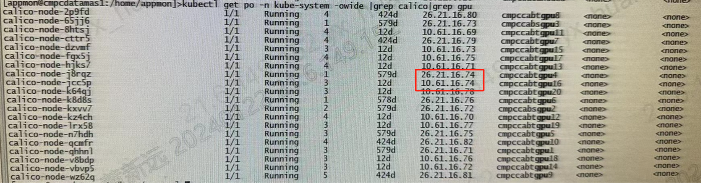

---
kind:
  - Troubleshooting
products:
  - Alauda Container Platform
  - Alauda DevOps
  - Alauda AI
  - Alauda Application Services
  - Alauda Service Mesh
  - Alauda Developer Portal
ProductsVersion:
  - 4.1.0,4.2.x
---
<!-- A type of document that involves encountering a fault, diagnosing it, performing root cause analysis, and providing solutions. -->

# k8s集群新增节点calico

calico-node使用本地网络启动 podip在同一网段

## Cause
- 节点名称解析到错误网卡IP

## Resolution
- 重新设置节点hosts解析到正确网卡IP
- 删除重建calico-node服务pod
- 重启使用本地节点网络的服务

## [workaround]

## [Related Information]
**Screenshots**

- Environment: 双网卡环境
- calico-node
- kubectl get node
- /etc/hosts
- 双网卡配置
- 节点名称解析
- Component: Calico
- Page ID: 185796576
- Original Title: k8s集群新增节点calico-node使用本地网络启动-但podip在同一网段-双网卡环境
