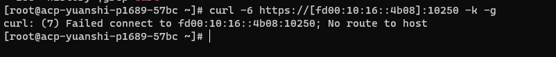
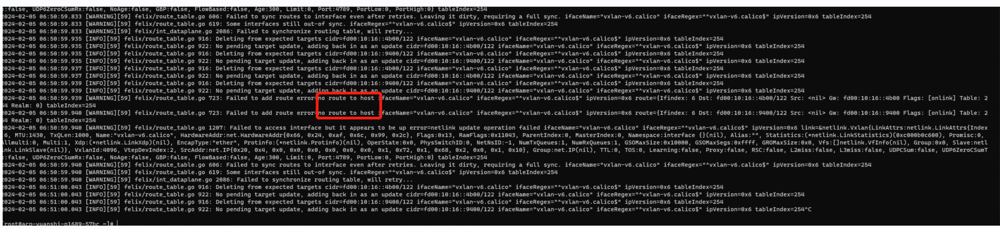

---kind:   - Troubleshootingproducts:    - Alauda Container Platform   - Alauda DevOps   - Alauda AI   - Alauda Application Services   - Alauda Service Mesh   - Alauda Developer PortalProductsVersion:   - 4.1.0,4.2.x---<!-- A type of document that involves encountering a fault, diag...it, performing root cause analysis, and providing solutions. --># Calico ipv6 vxlan部署的时候某pod访问svc 失败pod访问svc失败，跨节点的endpoint访问失败 访问跨节点后端提示no route to host vxlan路由缺失，calico-node日志报错## Cause- 内核版本低于4.19导致calico ipv6 vxlan功能不兼容## Resolution- 升级内核至4.19+版本## [workaround]## [Related Information]**Screenshots**- Environment: CentOS, kernel 3.10.0-1127.el7.x86_64, Calico 3.24- calico vxlan- ipv6- calico-node- ipvsadm- vxlan.calico- Component: Calico- Page ID: 188712217- Original Title: Calico ipv6 vxlan部署的时候某pod访问svc 失败