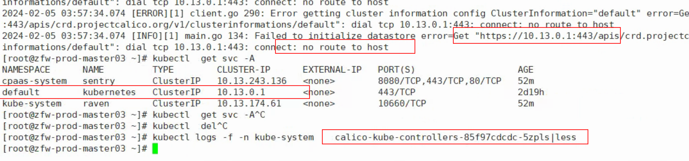
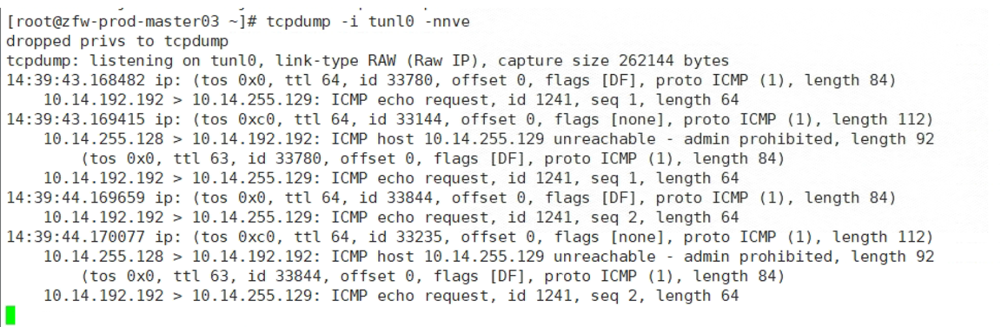
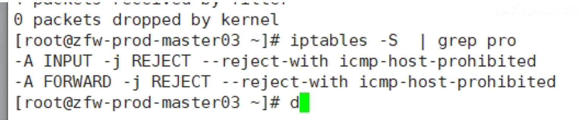

---kind:   - Troubleshootingproducts:    - Alauda Container Platform   - Alauda DevOps   - Alauda AI   - Alauda Application Services   - Alauda Service Mesh   - Alauda Developer PortalProductsVersion:   - 4.1.0,4.2.x---<!-- A type of document that involves encountering a fault, diag...it, performing root cause analysis, and providing solutions. --># calico 部署的时候calicocalico-kube-controller启动失败 跨节点pod通信报no route to host tunl0抓包显示icmp request返回admin prohibited## Cause- 节点配置了iptables DROP规则：-A INPUT -j DROP## Resolution- 删除异常iptables规则- 检查配置该iptables规则的服务并关闭## [workaround]## [Related Information]**Screenshots**- Environment: CentOS, Calico 3.24, ACP 3.12.1- iptables- tunl0- calico IPIP模式- calico-kube-controller- Component: Calico- Page ID: 188712238- Original Title: calico 部署的时候calico-kube-controller启动失败