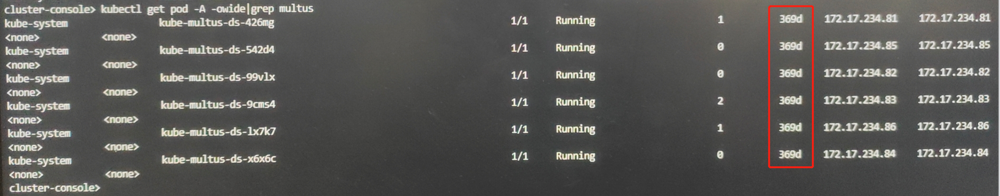

---
kind:
  - Troubleshooting
products:
  - Alauda Container Platform
  - Alauda DevOps
  - Alauda AI
  - Alauda Application Services
  - Alauda Service Mesh
  - Alauda Developer Portal
ProductsVersion:
  - 4.1.0,4.2.x
---
<!-- A type of document that involves encountering a fault, diagnosing it, performing root cause analysis, and providing solutions. -->

# Multus 报错 Unauthorized

Multus 报错 Unauthorized

## Cause
- 证书过期导致
- multus.kubeconfig 文件存在且问题发生在 multus pod 运行 1 年后

## Resolution
- 将 multus pod 删除重建
- 若无效则删除节点上的 /etc/cni/net.d/multus.d/multus.kubeconfig 后重建 multus pod

## [workaround]
- 修改 Multus 插件部署模式为 thick 模式以规避证书过期问题

## [Related Information]
**Screenshots**

- /etc/cni/net.d/multus.d/multus.kubeconfig
- Multus
- Kube-OVN
- thin 模式
- thick 模式
- Component: Calico
- Page ID: 195494246
- Original Title: Multus 报错 Unauthorized
