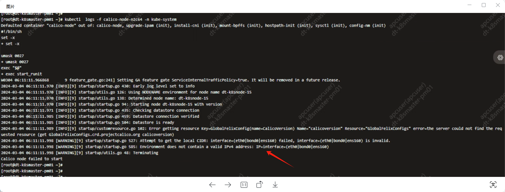
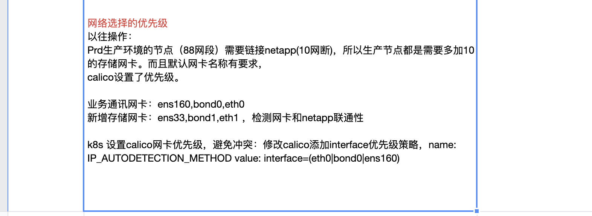
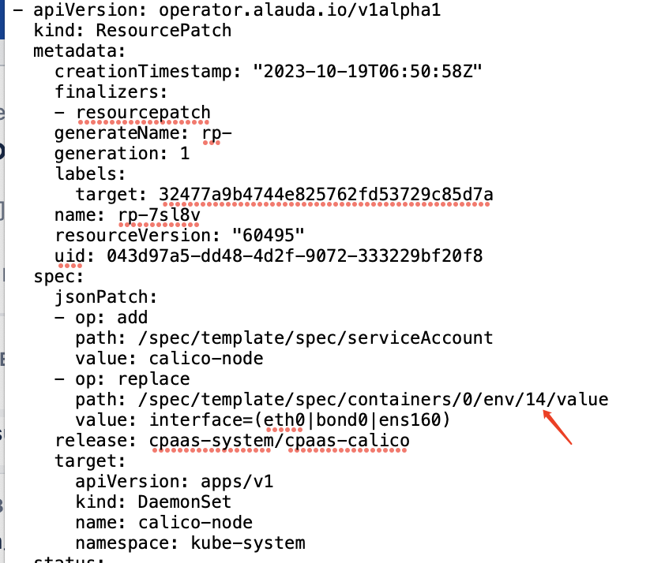
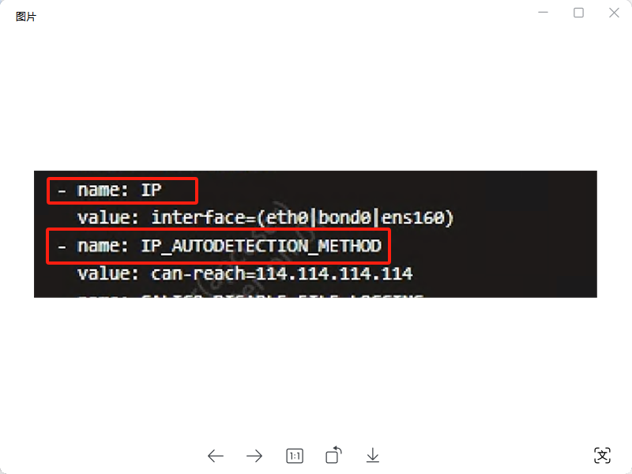
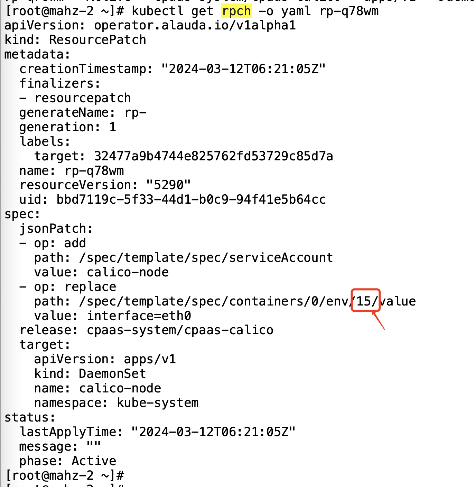
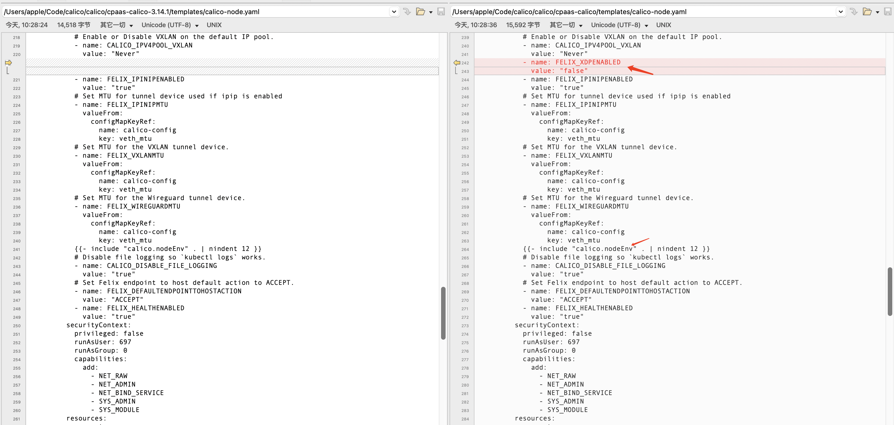

---
kind:
  - Troubleshooting
products:
  - Alauda Container Platform
  - Alauda DevOps
  - Alauda AI
  - Alauda Application Services
  - Alauda Service Mesh
  - Alauda Developer Portal
ProductsVersion:
  - 4.1.0,4.2.x
---
<!-- A type of document that involves encountering a fault, diagnosing it, performing root cause analysis, and providing solutions. -->

# calico升级，环境变量顺序问题

升级到3.14.2后出现错误 IP取值错误 IP_AUTODETECTION_METHOD环境变量值变为15

## Cause
- 环境变量顺序问题导致IP_AUTODETECTION_METHOD被错误覆盖
- 代码变更处理环境变量顺序的方式改变

## Resolution
- 重新设置环境变量取值

## [workaround]

## [Related Information]
**Screenshots**

- Environment: ACP集群3.14.0升级到3.14.2，Calico作为CNI，节点有多个网卡，手动修改过环境变量
- IP_AUTODETECTION_METHOD
- calico
- Component: Calico
- Page ID: 195495744
- Original Title: calico升级，环境变量顺序问题
