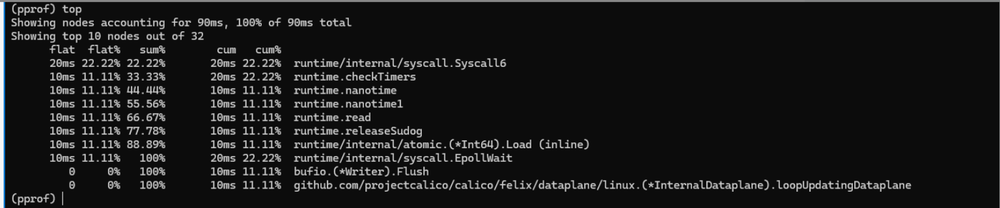

---
kind:
  - Troubleshooting
products:
  - Alauda Container Platform
  - Alauda DevOps
  - Alauda AI
  - Alauda Application Services
  - Alauda Service Mesh
  - Alauda Developer Portal
ProductsVersion:
  - 4.1.0,4.2.x
---
<!-- A type of document that involves encountering a fault, diagnosing it, performing root cause analysis, and providing solutions. -->

# calico

JIRA Jira：

## Cause

## Resolution
- 为了更好地了解calico-node组件的cpu、内存使用情况，可以尝试开启pprof debug来分析。
- ## 解决方案
- kubectl cp kube-system/calico-node-xxxxx:tmp/felix-cpu-xxxxx.pprof /tmp/calico.pprof（对应容器内文件可以先进到calico-node 容器内查看）

## [workaround]

## [Related Information]
**Screenshots**

- calico
- node
- 2024
- 52
- /tmp
- 12
- 697
- 09
- 04
- 00
- Component: Calico
- Page ID: 196906661
- Original Title: calico-node开启pprof debug功能
