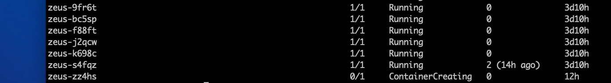
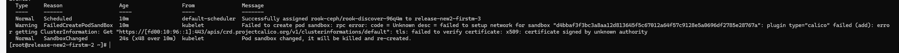
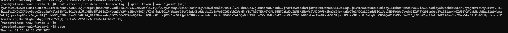
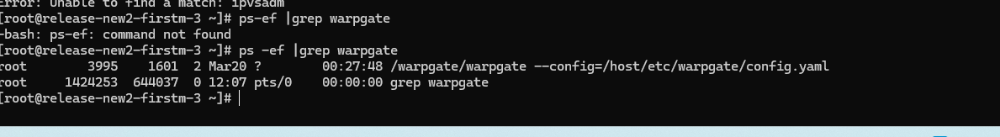

---kind:   - Troubleshootingproducts:    - Alauda Container Platform   - Alauda DevOps   - Alauda AI   - Alauda Application Services   - Alauda Service Mesh   - Alauda Developer PortalProductsVersion:   - 4.1.0,4.2.x---<!-- A type of document that involves encountering a fault, diag...it, performing root cause analysis, and providing solutions. --># 节点pod起不来显示calico 认证失败节点pod处于ContainerCreating状态 calico认证失败提示## Cause- warpgate程序导致containerd透传env给cni时走了http代理## Resolution- 修复AIT插件warpgate的bug## [workaround]## [Related Information]**Screenshots**- calico- containerd- warpgate- http_proxy- Component: Calico- Page ID: 198254515- Original Title: 节点pod起不来显示calico 认证失败