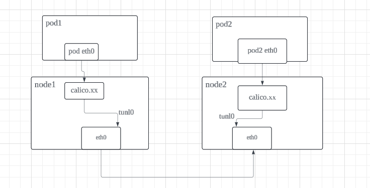
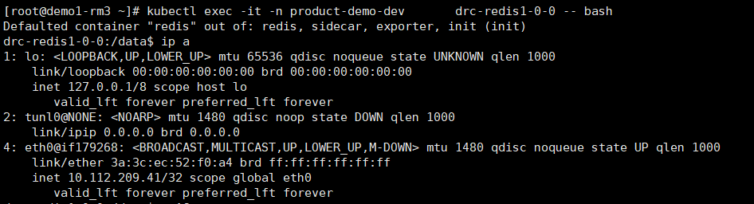
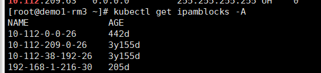
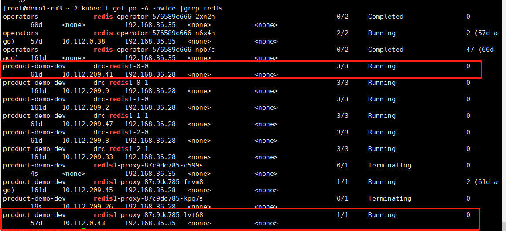
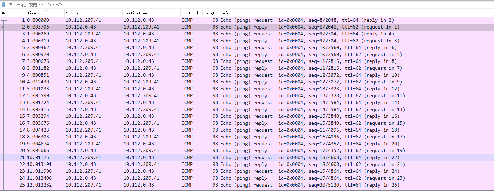
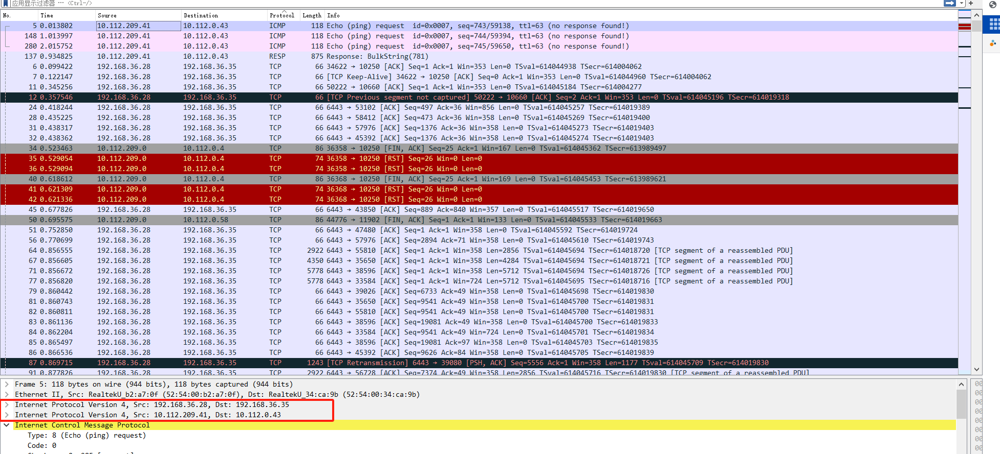

---
kind:
  - Troubleshooting
products:
  - Alauda Container Platform
  - Alauda DevOps
  - Alauda AI
  - Alauda Application Services
  - Alauda Service Mesh
  - Alauda Developer Portal
ProductsVersion:
  - 4.1.0,4.2.x
---
<!-- A type of document that involves encountering a fault, diagnosing it, performing root cause analysis, and providing solutions. -->

# calico ipip 跨节点pod通信详解

JIRA Jira：

## Cause

## Resolution
- 通过kubectl get ipamblocks -A查找容器地址段
- 在calico网卡执行抓包命令：tcpdump -i cali64e8186a81e -nnve -p icmp -w /root/cali64.pcap
- 在节点间抓包验证IPIP封装：tcpdump -i eth0 -nnve src host 192.168.36.28 -w /root/eth0.pcap

## [workaround]

## [Related Information]
**Screenshots**

（这里能看到有从pod1->pod2的出包，同时有pod2→pod1的回包，那么证明网络是从pod1 网卡eth0是发包到了cali64xxxx网卡）

- Environment: 通用版本
- calico.xx网卡
- tunl0网卡
- ipamblocks
- BGP路由协议
- 节点路由表
- Component: Calico
- Page ID: 198255545
- Original Title: calico ipip 跨节点pod通信详解
