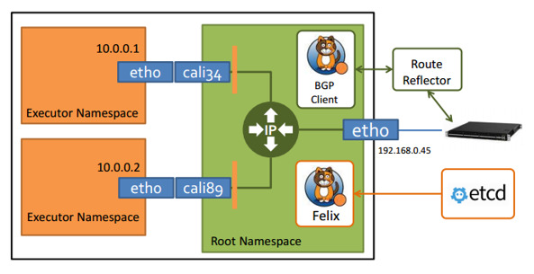
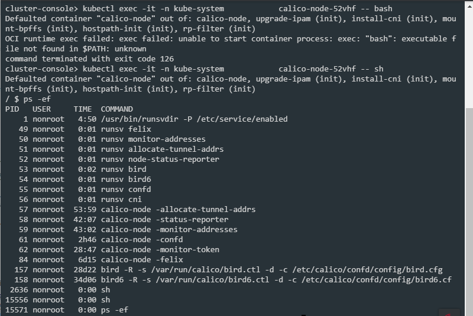

---
kind:
  - Troubleshooting
products:
  - Alauda Container Platform
  - Alauda DevOps
  - Alauda AI
  - Alauda Application Services
  - Alauda Service Mesh
  - Alauda Developer Portal
ProductsVersion:
  - 4.1.0,4.2.x
---
<!-- A type of document that involves encountering a fault, diagnosing it, performing root cause analysis, and providing solutions. -->

# calico 网络组件介绍

接口配置错误 路由信息不一致 ACL策略未生效

## Cause
- Felix配置错误
- BGP客户端异常
- BGP Router Reflector未正确配置
- confd监控etcd失败

## Resolution
- 检查Felix日志及状态报告
- 验证BGP客户端与Router Reflector连接
- 调整BGP Router Reflector配置
- 检查confd与etcd同步状态

## [workaround]
- 重启calico-node进程
- 临时禁用ACL策略

## [Related Information]
**Screenshots**

- Environment: 通用
- Felix
- Bird
- BGP Router Reflector
- confd
- etcd
- calico-node
- FIB
- BGP协议
- Component: Calico
- Page ID: 198257048
- Original Title: calico 网络组件介绍
