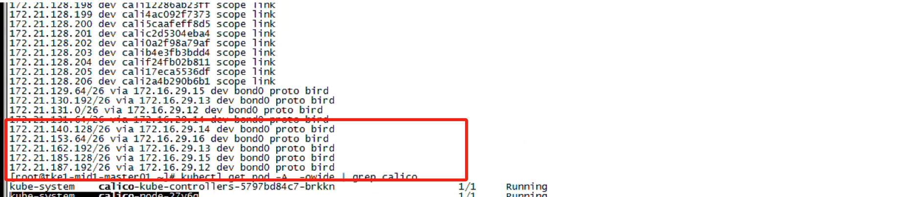
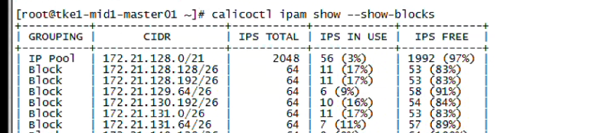
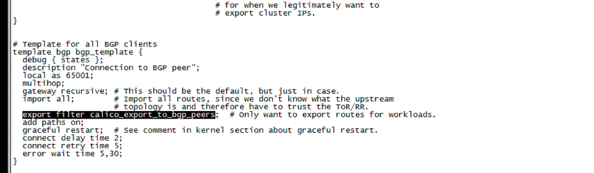
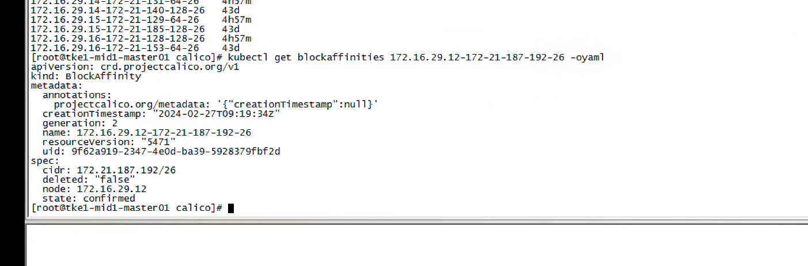

---
kind:
  - Troubleshooting
products:
  - Alauda Container Platform
  - Alauda DevOps
  - Alauda AI
  - Alauda Application Services
  - Alauda Service Mesh
  - Alauda Developer Portal
ProductsVersion:
  - 4.1.0,4.2.x
---
<!-- A type of document that involves encountering a fault, diagnosing it, performing root cause analysis, and providing solutions. -->

# calico bgp 环境下将网段调小后，旧的网段路由还在

调整ippool网段后旧ipamblock路由残留 删除ipamblock并重启组件后路由仍存在 calicoctl ipam show --show-blocks显示block已删除

## Cause
- 残留的blockaffinities CRD资源导致calico-node误判block归属

## Resolution
- 删除残留的ipamblock资源
- 删除关联的blockaffinities CRD资源

## [workaround]

## [Related Information]
**Screenshots**

- Environment: ACP 3.8.3
- ipamblock
- blockaffinities
- calicoctl ipam show --show-blocks
- bird.cfg
- calico-node
- calico-kube-controller
- Component: Calico
- Page ID: 201463350
- Original Title: calico bgp 环境下将网段调小后，旧的网段路由还在
