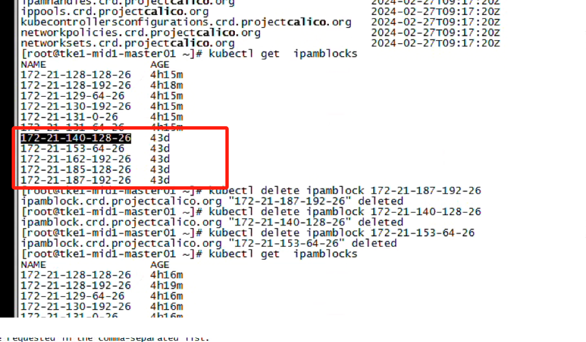

---kind:   - Troubleshootingproducts:    - Alauda Container Platform   - Alauda DevOps   - Alauda AI   - Alauda Application Services   - Alauda Service Mesh   - Alauda Developer PortalProductsVersion:   - 4.1.0,4.2.x---<!-- A type of document that involves encountering a fault, diag...it, performing root cause analysis, and providing solutions. --># calico bgp 环境下将网段调小后，旧的网段路由还在## 关联JIRA [TLZF-57](https://jira.alauda.cn/browse/TLZF-57)## Cause## Resolution- ## 排查步骤- 1. 检查 客户的ipamblock，发现有旧ippool的 ipamblock，删除掉，重启calico-node 和 calico-kube-controller- 2. 但是删除ipamblock 后发现路由还存在，并且执行calioctl ipam show --show-blocks 命令block 也都已删掉- 3. 继续检查bird.cfg相关的内容，export 路由的配置下，没有特殊的东西- 4. 最后检查到calico 还有个crd blockaffinities，一旦关联ipamblock就算不存在 calico-node 也认为这个block 属于节点， 删掉这些多余的blockaffinities 后，恢复正常。- ## 解决方法- 删除calico 多余的ipamblock 资源，和 blockaffinities资源。- 后来发现王硕之前写过修改网段的方案## [workaround]## [Related Information]**Screenshots**- calico- 2024- 21- 57- 172- 128- 25- node- 18- 39- Component: Calico- Page ID: 201463350- Original Title: calico bgp 环境下将网段调小后，旧的网段路由还在