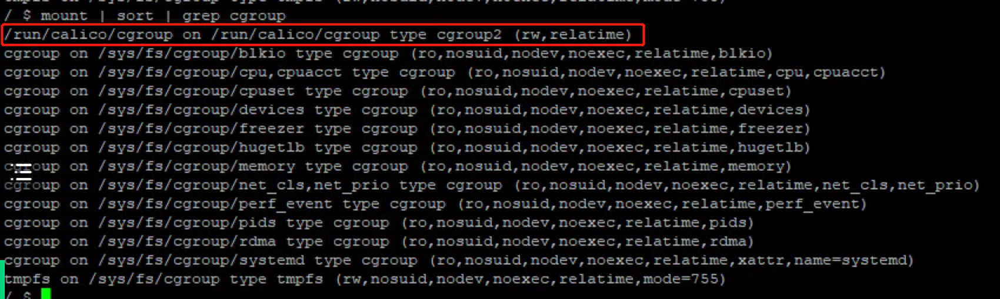
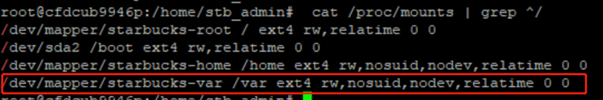
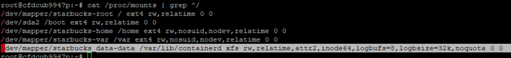

---kind:   - Troubleshootingproducts:    - Alauda Container Platform   - Alauda DevOps   - Alauda AI   - Alauda Application Services   - Alauda Service Mesh   - Alauda Developer PortalProductsVersion:   - 4.1.0,4.2.x---<!-- A type of document that involves encountering a fault, diag...it, performing root cause analysis, and providing solutions. --># calicocalico-node not ready ipset error: kernel error received operation not permitted iptables command permission denied in pod## Cause- containerd directory mounted on ext4 filesystem instead of XFS## Resolution- Adjust filesystem type or mount parameters for containerd directory- Use XFS filesystem for containerd directory## [workaround]## [Related Information]**Screenshots**- Environment: ubuntu 22.04.6, calico v3.26- calico-node- containerd- ipset- iptables- cgroup2- /var/lib/containerd- Component: Calico- Page ID: 207400554- Original Title: calico-node 无法正常启动：operation not permitted