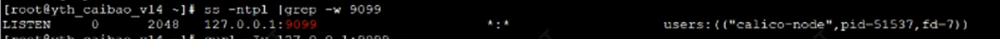

---
kind:
  - Troubleshooting
products:
  - Alauda Container Platform
  - Alauda DevOps
  - Alauda AI
  - Alauda Application Services
  - Alauda Service Mesh
  - Alauda Developer Portal
ProductsVersion:
  - 4.1.0,4.2.x
---
<!-- A type of document that involves encountering a fault, diagnosing it, performing root cause analysis, and providing solutions. -->

# 集群某个节点 calico

calico-node 健康检查失败：felix is not live 9099 端口本地监听正常但连接超时 10250 端口本地连接超时

## Cause
- 故障节点 lo 接口处于 down 状态

## Resolution
- ip link set lo up

## [workaround]

## [Related Information]
**Screenshots**

- 9099 端口
- 10250 端口
- calico-node
- kubelet
- lo 接口
- Component: Calico
- Page ID: 208961639
- Original Title: 集群某个节点 calico-node 健康检查失败：felix is not live
