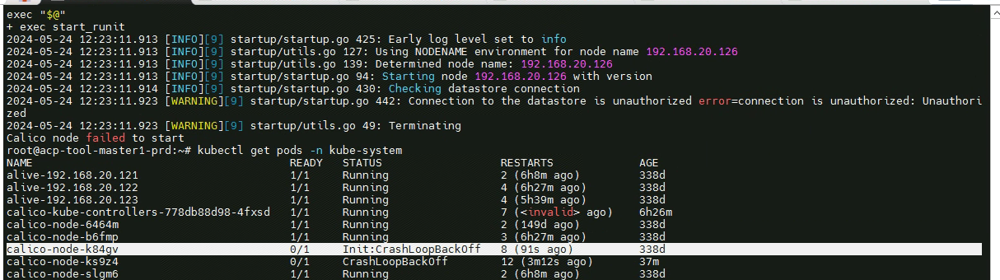
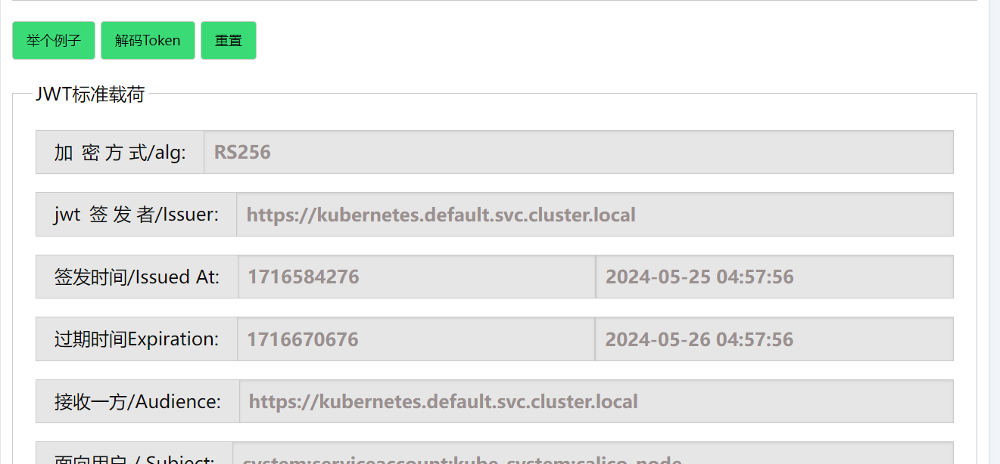

---
kind:
  - Troubleshooting
products:
  - Alauda Container Platform
  - Alauda DevOps
  - Alauda AI
  - Alauda Application Services
  - Alauda Service Mesh
  - Alauda Developer Portal
ProductsVersion:
  - 4.1.0,4.2.x
---
<!-- A type of document that involves encountering a fault, diagnosing it, performing root cause analysis, and providing solutions. -->

# 重启节点后集群状态异常

calico-node组件异常 认证失败错误日志 calico-kubeconfig文件token签发时间与当前时间不匹配

## Cause
- master3节点主机时间与其他master节点不一致

## Resolution
- 调整所有节点时间同步

## [workaround]

## [Related Information]
**Screenshots**

- Environment: 3.12.1
- calico-node
- /etc/cni/net.d/calico-kubeconfig
- kubernetes service account token
- master节点endpoints
- Component: Calico
- Page ID: 211779939
- Original Title: 容器平台-网络-重启节点后集群状态异常
