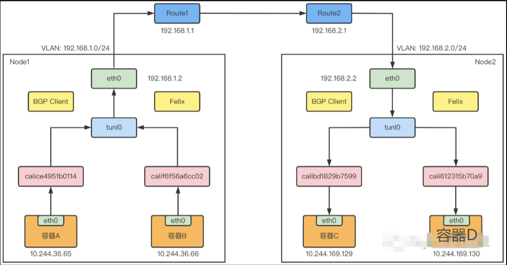
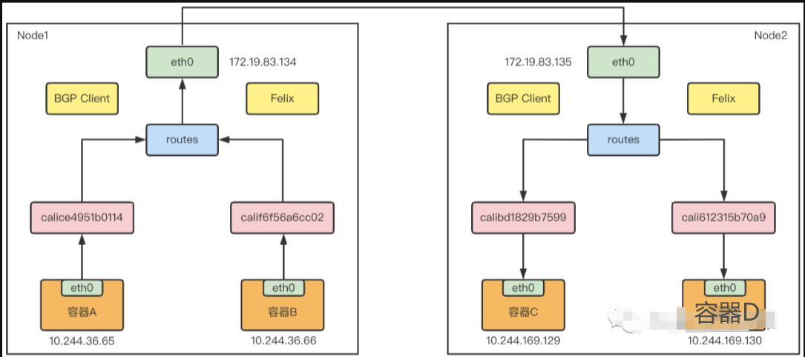

---
kind:
  - Troubleshooting
products:
  - Alauda Container Platform
  - Alauda DevOps
  - Alauda AI
  - Alauda Application Services
  - Alauda Service Mesh
  - Alauda Developer Portal
ProductsVersion:
  - 4.1.0,4.2.x
---
<!-- A type of document that involves encountering a fault, diagnosing it, performing root cause analysis, and providing solutions. -->

# 容器网络（Calico）

跨节点容器通信失败 网络性能低于预期 tunl0 隧道设备存在/缺失异常

## Cause
- IPIP 模式封包/解包导致性能损耗
- BGP 对等体未正确建立
- 路由表未正确传播

## Resolution
- 切换网络模式：calico_backend: bird"（BGP）或 "ipip"
- 检查 BGP 配置：/etc/calico/confd/config/bird.cfg
- 验证路由传播：calicoctl node status

## [workaround]

## [Related Information]
**Screenshots**

- Environment: Calico 网络环境（IPIP/BGP 模式）
- tunl0
- BGP
- IPIP
- calico_backend 配置项
- /etc/calico/confd/config/bird.cfg
- Component: Calico
- Page ID: 211780339
- Original Title: 容器网络（Calico）
