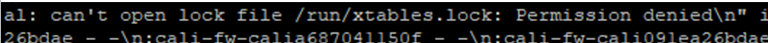
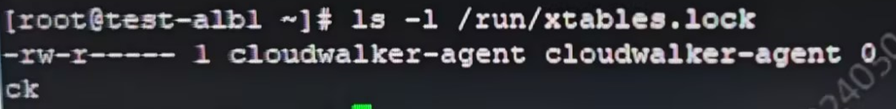

---
kind:
  - Troubleshooting
products:
  - Alauda Container Platform
  - Alauda DevOps
  - Alauda AI
  - Alauda Application Services
  - Alauda Service Mesh
  - Alauda Developer Portal
ProductsVersion:
  - 4.1.0,4.2.x
---
<!-- A type of document that involves encountering a fault, diagnosing it, performing root cause analysis, and providing solutions. -->

# 部分节点 calico

calico-node not Ready 文件权限报错

## Cause
- /run/xtables.lock owner不正确(非root)
- cloudwalker-agent systemd服务修改了文件权限

## Resolution
- chown root:root /run/xtables.lock
- chgrp root /run/xtables.lock

## [workaround]

## [Related Information]
**Screenshots**

- /run/xtables.lock
- calico-node
- cloudwalker-agent
- Component: Calico
- Page ID: 213189313
- Original Title: 部分节点 calico-node not Ready
