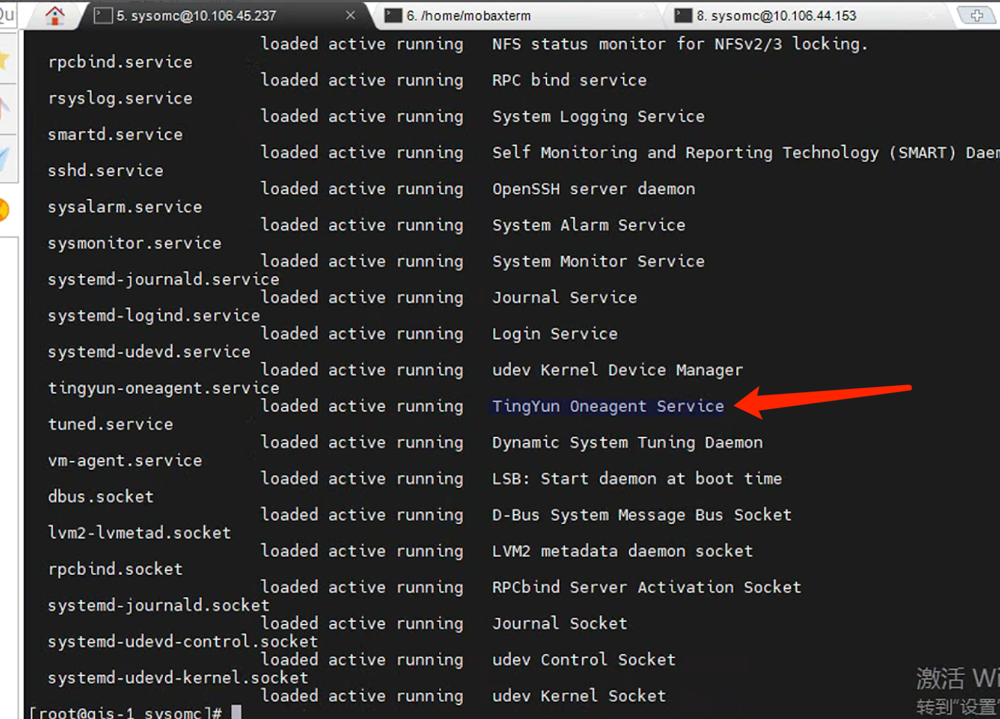

---
kind:
  - Troubleshooting
products:
  - Alauda Container Platform
  - Alauda DevOps
  - Alauda AI
  - Alauda Application Services
  - Alauda Service Mesh
  - Alauda Developer Portal
ProductsVersion:
  - 4.1.0,4.2.x
---
<!-- A type of document that involves encountering a fault, diagnosing it, performing root cause analysis, and providing solutions. -->

# calico

业务容器内ping外网地址不通 节点calico-node无法启动 calico-node日志报错：/bin/sh: error while loading shared libraries: libm.so.6: cannot open shared object file: No such file or directory

## Cause
- tingyun安全组件进程影响calico网络运行

## Resolution
- systemctl stop tingyun-oaengent
- kubectl delete pod -n kube-system calico-xxxx
- systemctl start tingyun-oaengent（不建议开启）

## [workaround]

## [Related Information]
**Screenshots**

- Environment: TKE 3.0.3 + Calico网络（智慧园区22.2环境）
- calico-node
- tingyun-oaengent
- kube-system
- libm.so.6
- Component: Calico
- Page ID: 213189810
- Original Title: 容器平台-calico-业务容器和外网不通
