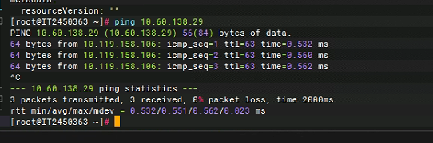
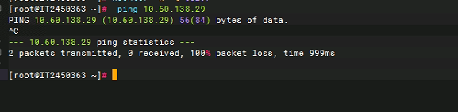
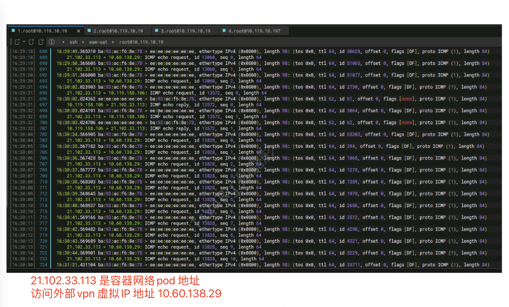
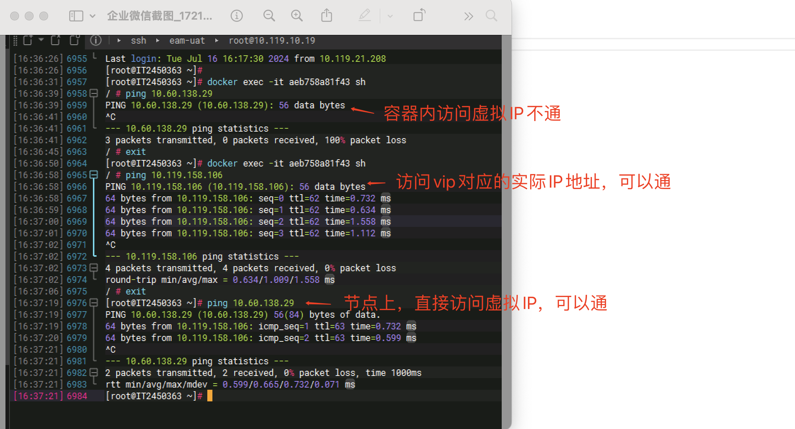

---
kind:
  - Troubleshooting
products:
  - Alauda Container Platform
  - Alauda DevOps
  - Alauda AI
  - Alauda Application Services
  - Alauda Service Mesh
  - Alauda Developer Portal
ProductsVersion:
  - 4.1.0,4.2.x
---
<!-- A type of document that involves encountering a fault, diagnosing it, performing root cause analysis, and providing solutions. -->

# 伊利，容器网络 pod ping 外部地址不通

容器内无法访问外部VPN VIP地址 容器内访问物理服务器地址正常 主机访问VIP和物理服务器均正常

## Cause
- VPN VIP地址响应包的源地址与请求包目标地址不一致
- 物理服务器到容器网络的路由配置异常

## Resolution
- 联系基础设施团队调整网络环境配置
- 确保VIP响应包的源地址与请求目标地址一致

## [workaround]

## [Related Information]
**Screenshots**

- Environment: Kubernetes with Calico CNI 3.24.1, ACP 3.14.1
- calico 3.24.1
- Kubernetes节点路由
- VPN VIP配置
- 物理服务器路由表
- Component: Calico
- Page ID: 221885758
- Original Title: 伊利，容器网络 pod ping 外部地址不通
