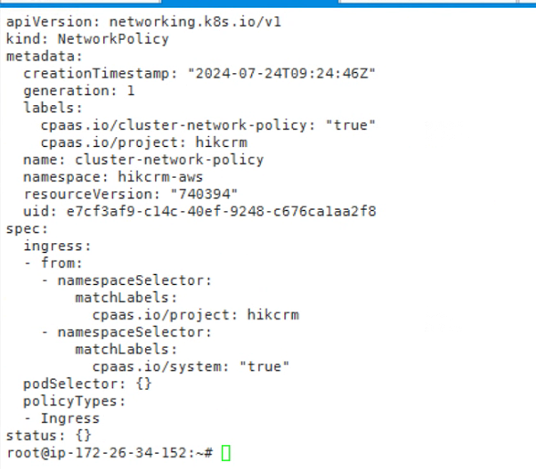

---
kind:
  - Troubleshooting
products:
  - Alauda Container Platform
  - Alauda DevOps
  - Alauda AI
  - Alauda Application Services
  - Alauda Service Mesh
  - Alauda Developer Portal
ProductsVersion:
  - 4.1.0,4.2.x
---
<!-- A type of document that involves encountering a fault, diagnosing it, performing root cause analysis, and providing solutions. -->

# 集群策略规则开启项目隔离后 节点访问跨节点的pod不通

节点访问跨节点的pod不通 节点访问podip时srcip是tunl0的ip

## Cause
- tunl0的ip属于calico pod cidr范围，触发namespace networkpolicy过滤规则

## Resolution
- 不建议在calico集群下开启集群策略项目隔离

## [workaround]

## [Related Information]
**Screenshots**

- Environment: Kubernetes集群使用Calico作为CNI插件
- networkpolicy
- calico
- tunl0
- pod cidr
- Component: Calico
- Page ID: 223292221
- Original Title: 集群策略规则开启项目隔离后 节点访问跨节点的pod不通
