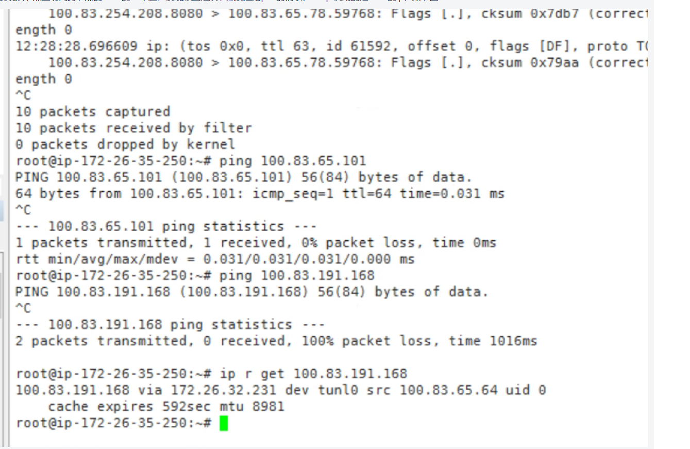

---kind:   - Troubleshootingproducts:    - Alauda Container Platform   - Alauda DevOps   - Alauda AI   - Alauda Application Services   - Alauda Service Mesh   - Alauda Developer PortalProductsVersion:   - 4.1.0,4.2.x---<!-- A type of document that involves encountering a fault, diag...it, performing root cause analysis, and providing solutions. --># 集群策略规则开启项目隔离后 节点访问跨节点的pod不通节点访问跨节点的pod不通 源IP为tunl0接口IP（属于calico pod cidr）## Cause- networkpolicy过滤了来自calico pod cidr的流量## Resolution- 不建议在calico集群下开启集群策略项目隔离## [workaround]## [Related Information]**Screenshots**- Environment: CNI: Calico- networkpolicy- calico tunl0- pod cidr- Component: Calico- Page ID: 223292221- Original Title: 集群策略规则开启项目隔离后 节点访问跨节点的pod不通