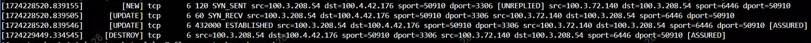
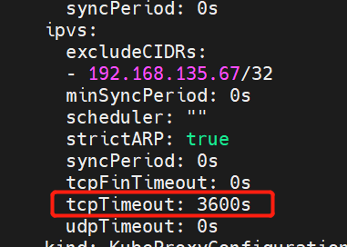

---
kind:
  - Troubleshooting
products:
  - Alauda Container Platform
  - Alauda DevOps
  - Alauda AI
  - Alauda Application Services
  - Alauda Service Mesh
  - Alauda Developer Portal
ProductsVersion:
  - 4.1.0,4.2.x
---
<!-- A type of document that involves encountering a fault, diagnosing it, performing root cause analysis, and providing solutions. -->

# 空闲 tcp 连接 900s 后通信出现 connection reset

空闲 tcp 连接 900s 后通信出现 connection reset client 端连接消失但 server 端连接仍存在 conntrack 记录在 930s 后消失

## Cause
- ipvs 默认 tcp 空闲超时时间为 900s 自动清理连接

## Resolution
- 修改 client 应用保活间隔或启用 tcp keepalive
- 修改 kube-proxy 配置: kubectl -n kube-system edit cm kube-proxy 调整 ipvs.tcpTimeout 参数(如 3600s)并重建

## [workaround]

## [Related Information]
**Screenshots**

- Environment: Kubernetes ipvs 模式，CNI 为 calico 或关闭 ovn lb 的 kube-ovn
- kube-proxy
- ipvs-sync-period
- ipvs-tcp-timeout
- conntrack
- calico
- kube-ovn
- Component: Calico
- Page ID: 228558619
- Original Title: 空闲 tcp 连接 900s 后通信出现 connection reset
