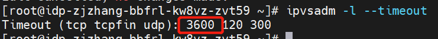

---kind:   - Troubleshootingproducts:    - Alauda Container Platform   - Alauda DevOps   - Alauda AI   - Alauda Application Services   - Alauda Service Mesh   - Alauda Developer PortalProductsVersion:   - 4.1.0,4.2.x---<!-- A type of document that involves encountering a fault, diag...it, performing root cause analysis, and providing solutions. --># 空闲 tcp 连接 900s 后通信出现 connection reset空闲 tcp 连接 900s 后通信出现 connection reset client 端连接消失，server 端 tcp 连接仍存在 conntrack 记录约 930s 后消失## Cause- ipvs 默认 tcp 空闲超时时间（900s）触发连接清理## Resolution- 修改 client 应用保活间隔或启用 tcp keepalive- 调整 kube-proxy 配置：kubectl -n kube-system edit cm kube-proxy，设置 config.conf.ipvs.tcpTimeout 为 3600s 并重建 pod## [workaround]## [Related Information]**Screenshots**- Environment: Kubernetes 集群，IPVS 模式，Calico 或 kube-ovn（关闭 ovn lb）- kube-proxy- ipvs- conntrack- ipvs-tcp-timeout- ipvs-sync-period- calico- kube-ovn- Component: Calico- Page ID: 228558619- Original Title: 空闲 tcp 连接 900s 后通信出现 connection reset