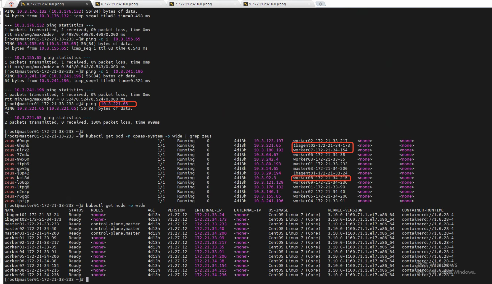
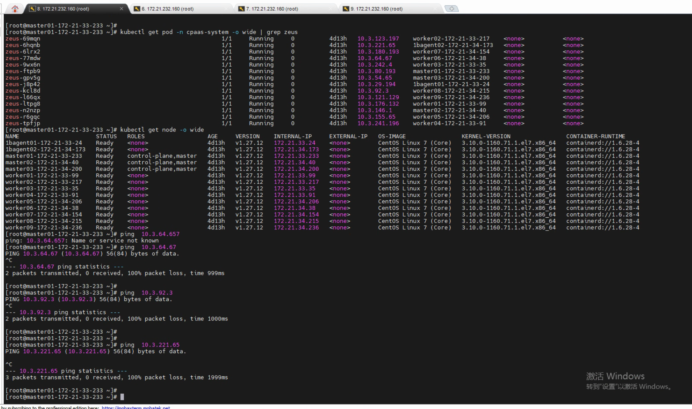

---
kind:
  - Troubleshooting
products:
  - Alauda Container Platform
  - Alauda DevOps
  - Alauda AI
  - Alauda Application Services
  - Alauda Service Mesh
  - Alauda Developer Portal
ProductsVersion:
  - 4.1.0,4.2.x
---
<!-- A type of document that involves encountering a fault, diagnosing it, performing root cause analysis, and providing solutions. -->

# 研祥智能，calico网络跨节点网络不通

跨节点访问pod有不通的情况 从master节点访问3个特定节点上的pod不通

## Cause
- 网络规则限制导致跨节点通信异常

## Resolution
- 联系IAAS团队调整网络规则(具体规则未反馈)

## [workaround]

## [Related Information]
**Screenshots**

- Environment: CNI版本: calico集群, ACP 3.16.1
- default_ipv4_ippool
- ipipAlways
- CrossSubnet
- BGP
- calico node status
- Component: Calico
- Page ID: 231116411
- Original Title: 研祥智能，calico网络跨节点网络不通
