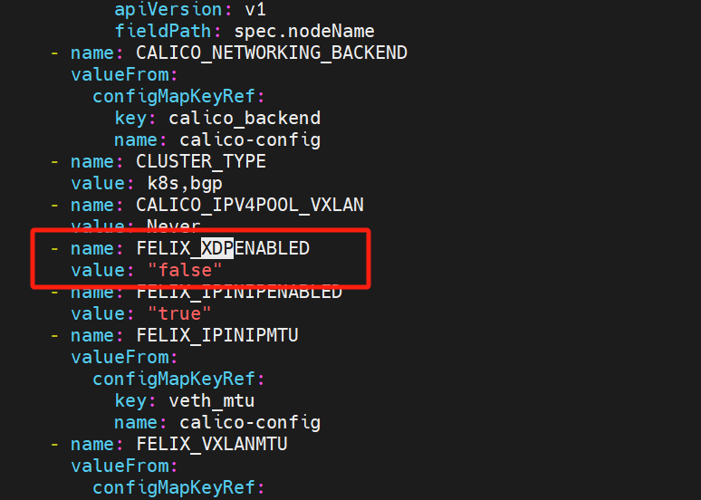

---
kind:
  - Troubleshooting
products:
  - Alauda Container Platform
  - Alauda DevOps
  - Alauda AI
  - Alauda Application Services
  - Alauda Service Mesh
  - Alauda Developer Portal
ProductsVersion:
  - 4.1.0,4.2.x
---
<!-- A type of document that involves encountering a fault, diagnosing it, performing root cause analysis, and providing solutions. -->

# calico日志量很大，导致k8s日志量占用很大

calico日志量很大，导致k8s日志量占用很大 calico日志报错failed to disable XDP，failed to load BPF program

## Cause
- calico自动开启了XDP功能

## Resolution
- 在calico-node的ds和pod的yaml里添加环境变量FELIX_XDPENABLED=false关闭XDP功能

## [workaround]

## [Related Information]
**Screenshots**
calico自动开启了XDP功能，产品暂时不需要该功能，在calico-node的ds和pod的yaml里添加如下变量，关闭XDP功能即可。
- Environment: 3.14.2之前版本
- calico-node
- FELIX_XDPENABLED
- Component: Calico
- Page ID: 233867075
- Original Title: calico日志量很大，导致k8s日志量占用很大
