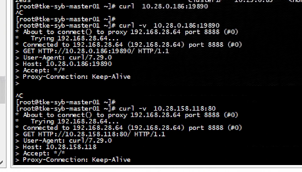
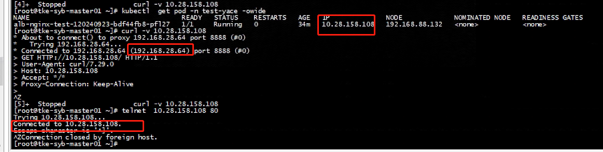
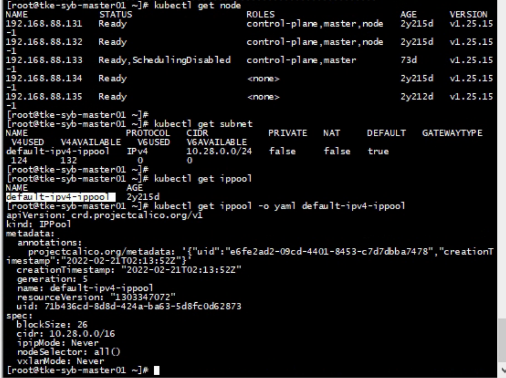
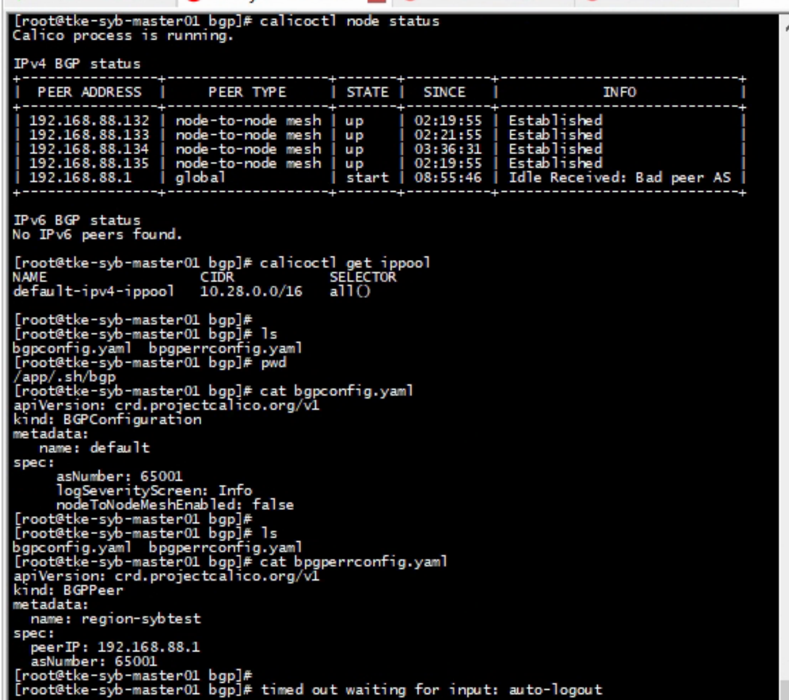
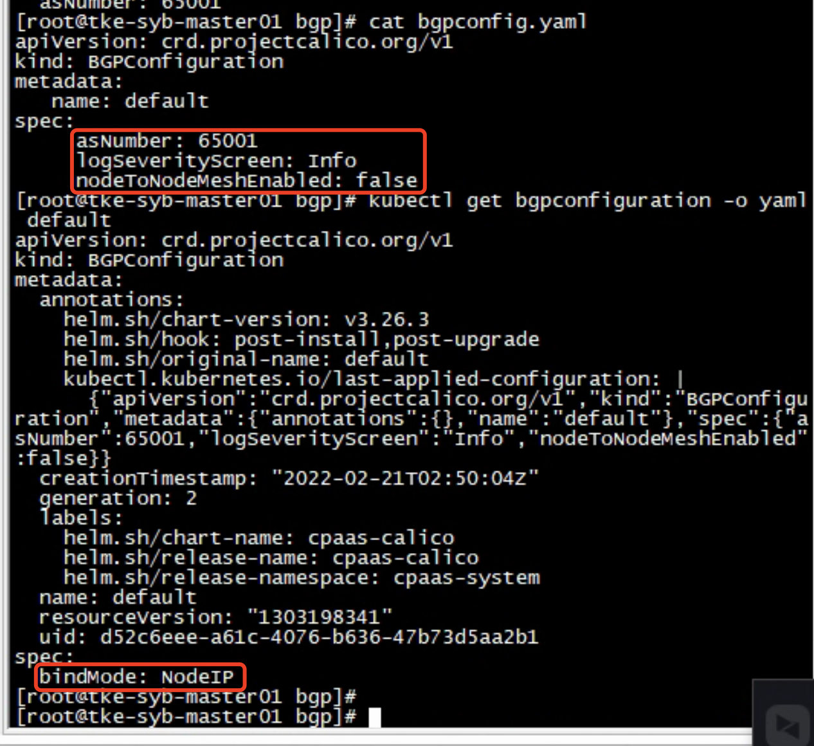
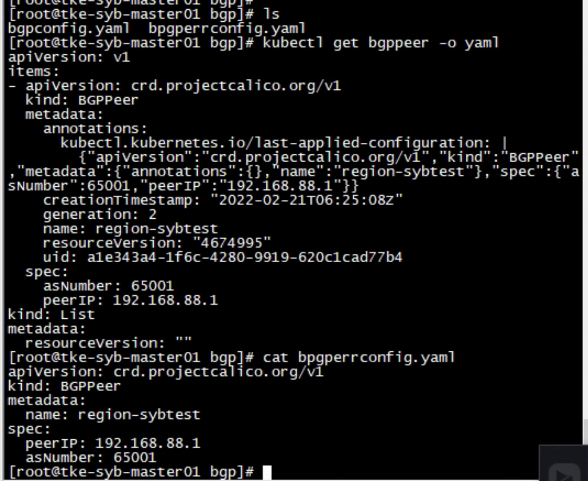
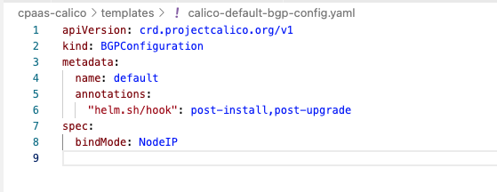

---kind:   - Troubleshootingproducts:    - Alauda Container Platform   - Alauda DevOps   - Alauda AI   - Alauda Application Services   - Alauda Service Mesh   - Alauda Developer PortalProductsVersion:   - 4.1.0,4.2.x---<!-- A type of document that involves encountering a fault, diag...it, performing root cause analysis, and providing solutions. --># 通联支付，Calico集群 3.8升级3.12，升级后访问外网不通跨节点 curl 容器网络 pod 不通 ping 和 telnet 测试正常## Cause- Calico 3.8 升级 3.12 时 bgpconfiguration 资源丢失原有配置- 升级后仅保留 bindMode 参数## Resolution- 手动恢复 bgpconfiguration 原有配置## [workaround]## [Related Information]**Screenshots**- Environment: Kubernetes with Calico CNI- bgpconfiguration- calico- BGP 179端口- ACP 3.8->3.12- Component: Calico- Page ID: 234980376- Original Title: 通联支付，Calico集群 3.8升级3.12，升级后访问外网不通