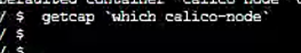
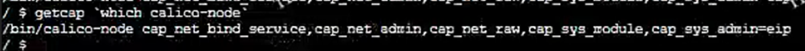

---kind:   - Troubleshootingproducts:    - Alauda Container Platform   - Alauda DevOps   - Alauda AI   - Alauda Application Services   - Alauda Service Mesh   - Alauda Developer PortalProductsVersion:   - 4.1.0,4.2.x---<!-- A type of document that involves encountering a fault, diag...it, performing root cause analysis, and providing solutions. --># calicobird: Netlink: Operation not permitted ipset/iptables Operation not permitted## Cause- /var/lib/containerd 挂载的 LV 卷/XFS 文件系统损坏导致容器缺失 linux capabilities 属性## Resolution- 修复存储设备/文件系统故障- 删除已有 calico-node 镜像及 Pod## [workaround]- 取消 /var/lib/containerd 挂载## [Related Information]**Screenshots**- calico-node- containerd- XFS- linux capabilities- iptables- ipset- Component: Calico- Page ID: 272236943- Original Title: calico-node 出现 bird: Netlink: Operation not permitted