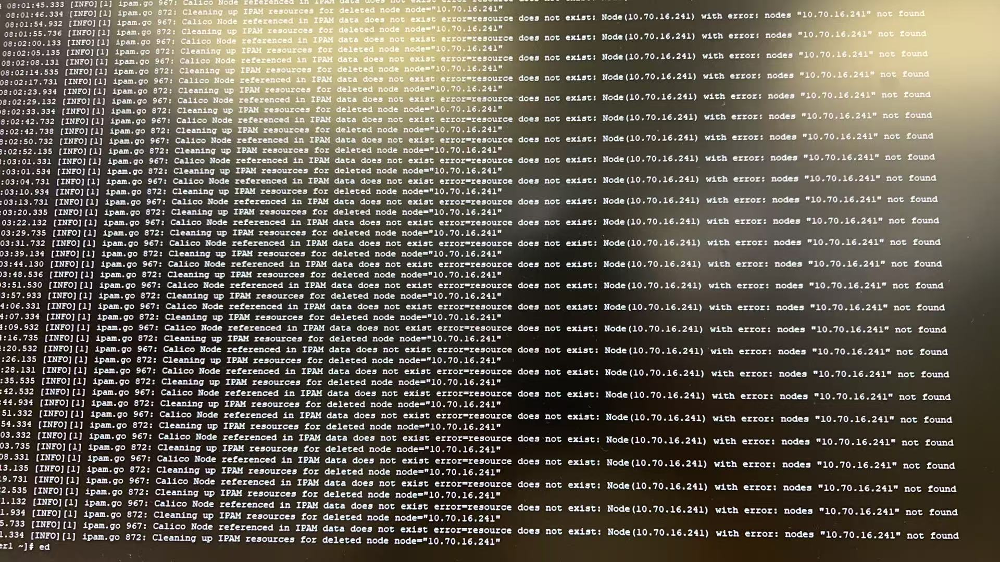
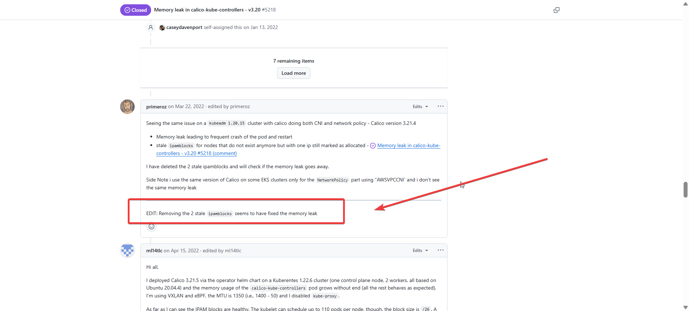
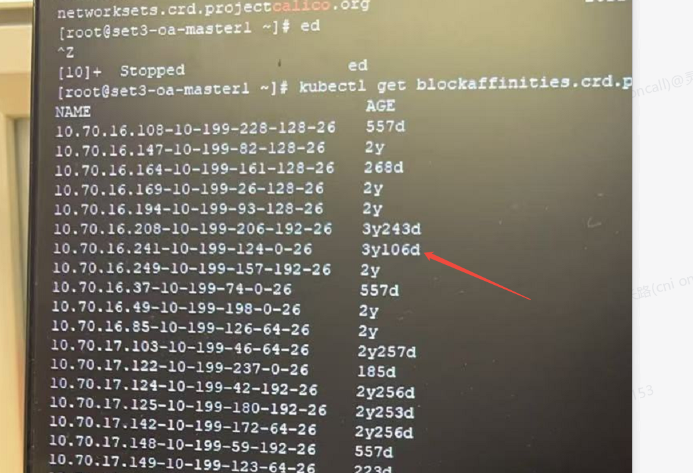

---kind:   - Troubleshootingproducts:    - Alauda Container Platform   - Alauda DevOps   - Alauda AI   - Alauda Application Services   - Alauda Service Mesh   - Alauda Developer PortalProductsVersion:   - 4.1.0,4.2.x---<!-- A type of document that involves encountering a fault, diag...it, performing root cause analysis, and providing solutions. --># acp 3.8.2 calicocalico-kube-controller 内存飙升到 24G 报错 10.70.16.241 节点 not found## Cause- calico 历史 bug 导致内存泄漏（GitHub issue #5218）## Resolution- kubectl get blockaffinities- kubectl delete 对应的 ipamblock 和 blockaffinites- 重启 calico-kube-controller## [workaround]## [Related Information]**Screenshots**- Environment: ACP 3.8, calico v3.20.2- calico-kube-controller- ipamblock- blockaffinities- XMGJ-162- calico/issues/5218- Component: Calico- Page ID: 273350854- Original Title: acp 3.8.2 calico-kube-controller oom