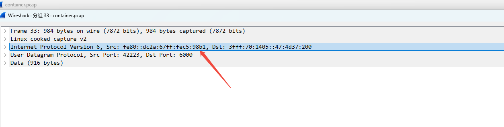

---
kind:
  - Troubleshooting
products:
  - Alauda Container Platform
  - Alauda DevOps
  - Alauda AI
  - Alauda Application Services
  - Alauda Service Mesh
  - Alauda Developer Portal
ProductsVersion:
  - 4.1.0,4.2.x
---
<!-- A type of document that involves encountering a fault, diagnosing it, performing root cause analysis, and providing solutions. -->

# calico ipv6 pod 发送

calico pod 发出的 UDP 请求报文被丢弃 client pod 发出的 IPv6 报文源 IP 是 link-local 地址

## Cause
- 客户应用程序未使用分配的 IPv6 地址而使用了 link-local 地址

## Resolution
- 让客户修复应用程序使用正确的 IPv6 地址

## [workaround]

## [Related Information]
**Screenshots**

- IPv6
- UDP
- link-local 地址
- calico
- CNI
- Component: Calico
- Page ID: 273351025
- Original Title: calico ipv6 pod 发送
