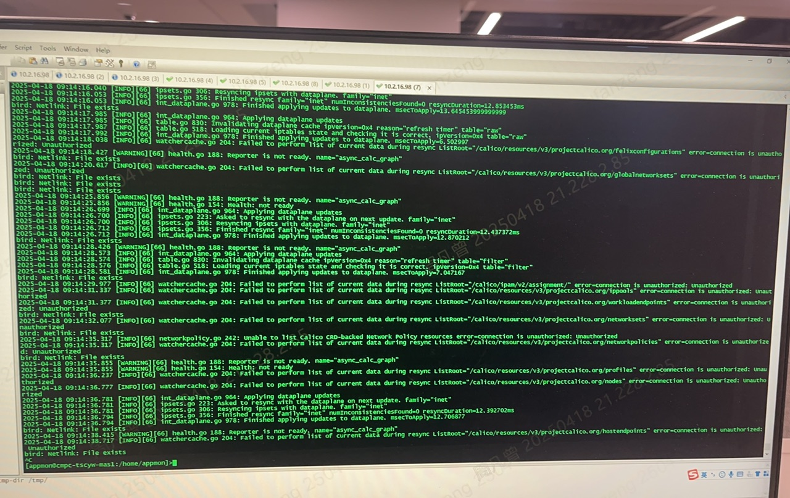
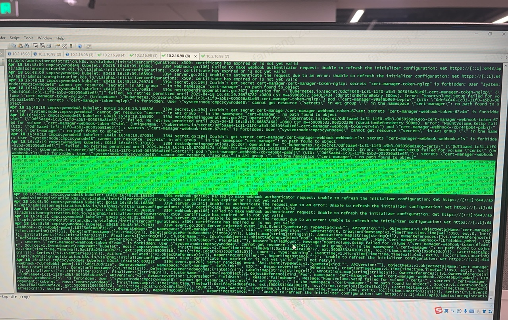
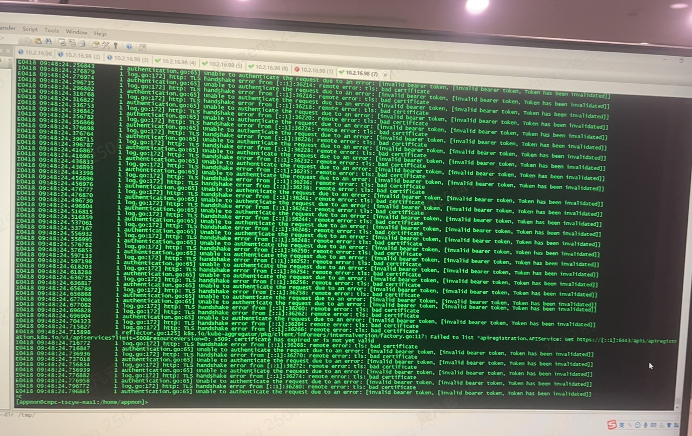

---kind:   - Troubleshootingproducts:    - Alauda Container Platform   - Alauda DevOps   - Alauda AI   - Alauda Application Services   - Alauda Service Mesh   - Alauda Developer PortalProductsVersion:   - 4.1.0,4.2.x---<!-- A type of document that involves encountering a fault, diag...it, performing root cause analysis, and providing solutions. --># calicocalico-node 状态异常（Not Ready） 新创建的 Pod 卡在 ContainerCreating 状态 kubelet 日志出现证书过期/非法报错## Cause- kube-apiserver 运行超过一年未重启导致证书问题## Resolution- 手动删除 apiserver 容器触发重启## [workaround]## [Related Information]**Screenshots**- Environment: ACP v2.6- 6443 端口- kube-apiserver- TLS 证书- Component: Calico- Page ID: 279576718- Original Title: calico-node 报错：connection is unauthorized: Unauthorized