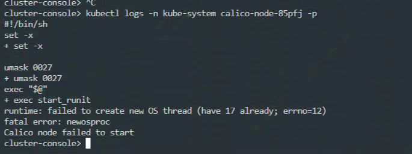
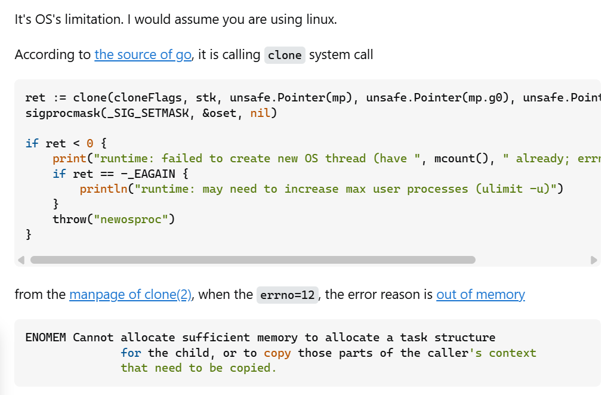
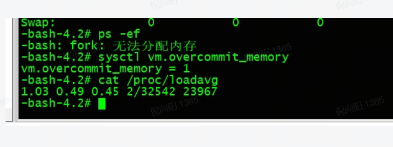

---
kind:
  - Troubleshooting
products:
  - Alauda Container Platform
  - Alauda DevOps
  - Alauda AI
  - Alauda Application Services
  - Alauda Service Mesh
  - Alauda Developer Portal
ProductsVersion:
  - 4.1.0,4.2.x
---
<!-- A type of document that involves encountering a fault, diagnosing it, performing root cause analysis, and providing solutions. -->

# calico

calico-node 启动失败：failed to create new OS thread 报错中的 errno=12

## Cause
- 节点上有三个服务将线程数都占满

## Resolution

## [workaround]

## [Related Information]
**Screenshots**

- Component: Calico
- Page ID: 310085023
- Original Title: calico-node 启动失败：failed to create new OS thread
