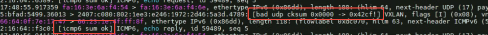

---kind:   - Troubleshootingproducts:    - Alauda Container Platform   - Alauda DevOps   - Alauda AI   - Alauda Application Services   - Alauda Service Mesh   - Alauda Developer PortalProductsVersion:   - 4.1.0,4.2.x---<!-- A type of document that involves encountering a fault, diag...it, performing root cause analysis, and providing solutions. --># 跨节点 IPv6 通信故障双副本 Service 的 NodePort 访问有 50% 的几率故障 tcpdump 中出现 bad udp cksum 提示## Cause- virtio-net 网卡 tx checksumming offload 导致 IPv6 报文校验和异常## Resolution- ethtool -K eth0 tx off- 关闭两个节点上 eth0 网卡的 tx checksumming offload 功能## [workaround]## [Related Information]**Screenshots**- Environment: 虚拟机节点(virtio-net 网卡)- vxlan-v6.calico- eth0- tx checksumming offload- virtio-net- Component: Calico- Page ID: 310085028- Original Title: 跨节点 IPv6 通信故障