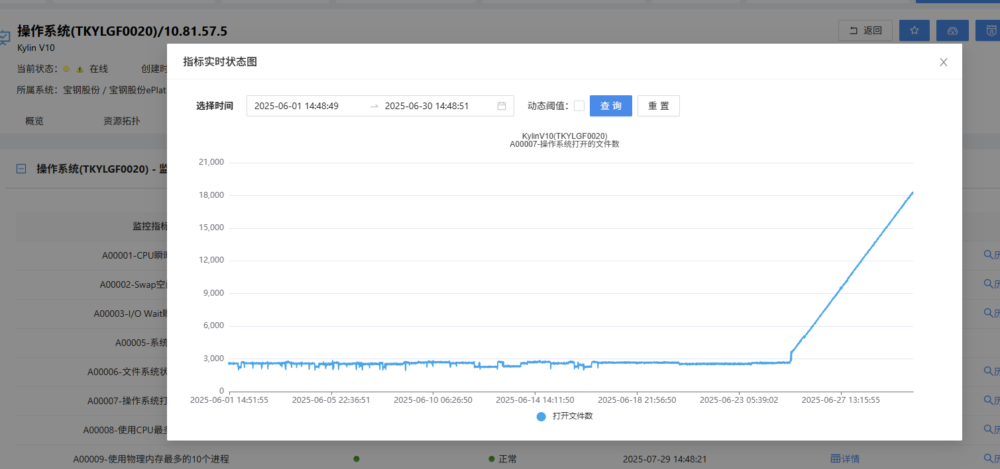
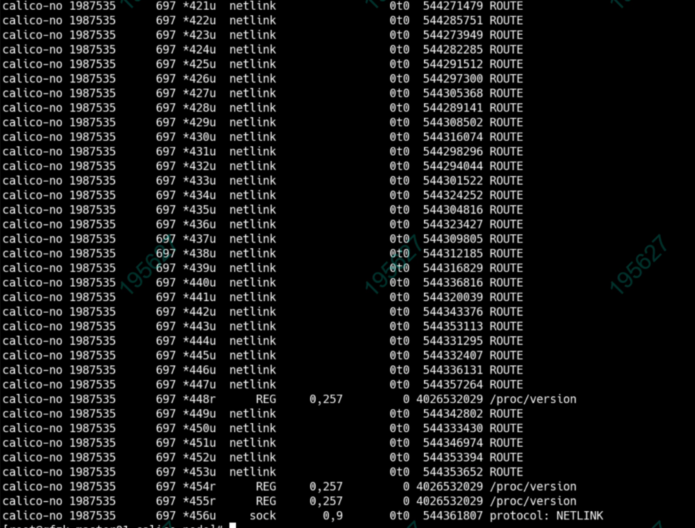

---
kind:
  - Troubleshooting
products:
  - Alauda Container Platform
  - Alauda DevOps
  - Alauda AI
  - Alauda Application Services
  - Alauda Service Mesh
  - Alauda Developer Portal
ProductsVersion:
  - 4.1.0,4.2.x
---
<!-- A type of document that involves encountering a fault, diagnosing it, performing root cause analysis, and providing solutions. -->

# 麒麟sp3 内核升级后calico的句柄泄漏

calico 环境内核升级后出现句柄泄漏 lsof -p ${calico -fleix 的pid} 显示 netlink 句柄泄漏

## Cause
- 内核版本 4.19.90-52.45.v2207.ky10.x86_64 升级引入的 netlink 句柄泄漏问题

## Resolution

## [workaround]

## [Related Information]
**Screenshots**

- Environment: 操作系统：麒麟sp3；内核：4.19.90-52.45.v2207.ky10.x86_64；Kubernetes 版本：未明确；CNI 版本：Calico；其他信息：acp 4.0.2
- calico-felix
- netlink
- 4.19.90-52.45.v2207.ky10.x86_64
- 4.19.90-52.22.v2207.ky10.x86_64
- Component: Calico
- Page ID: 323682633
- Original Title: 麒麟sp3 内核升级后calico的句柄泄漏
