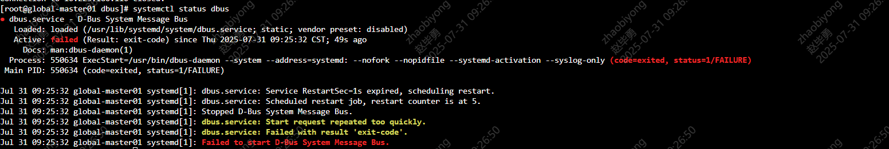

---
kind:
  - Troubleshooting
products:
  - Alauda Container Platform
  - Alauda DevOps
  - Alauda AI
  - Alauda Application Services
  - Alauda Service Mesh
  - Alauda Developer Portal
ProductsVersion:
  - 4.1.0,4.2.x
---
<!-- A type of document that involves encountering a fault, diagnosing it, performing root cause analysis, and providing solutions. -->

# 升级过程中calico启动失败

calico-node容器启动失败，报错'dial unix /host/var/run/dbus/system_bus_socket: connect: connection refused'

## Cause
- dbus服务异常，原因为/etc/dbus-1/system.d/*.conf中用户密码配置被注释

## Resolution
- 修复dbus服务配置（取消密码注释）并重启dbus服务

## [workaround]

## [Related Information]
**Screenshots**

- Environment: 3.12.2
- dbus
- calico-node
- /host/var/run/dbus/system_bus_socket
- /etc/dbus-1/system.d/
- Component: Calico
- Page ID: 327285253
- Original Title: 容器平台-网络-其他CNI组件-升级过程中calico启动失败-114136
