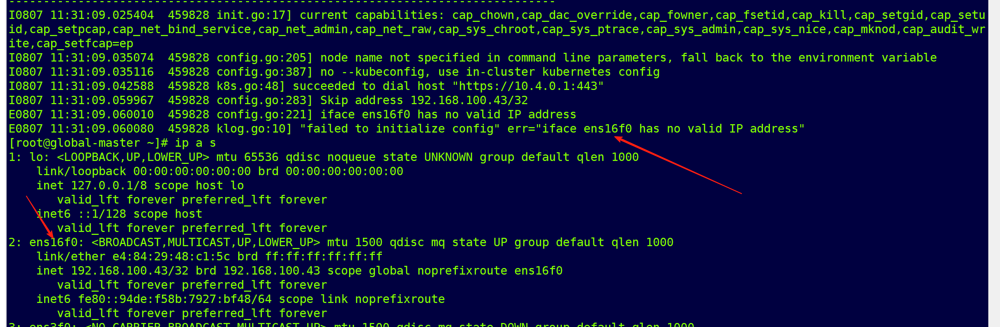

---
kind:
  - Troubleshooting
products:
  - Alauda Container Platform
  - Alauda DevOps
  - Alauda AI
  - Alauda Application Services
  - Alauda Service Mesh
  - Alauda Developer Portal
ProductsVersion:
  - 4.1.0,4.2.x
---
<!-- A type of document that involves encountering a fault, diagnosing it, performing root cause analysis, and providing solutions. -->

# 部署平台网络插件启动失败

部署平台网络插件启动失败

## Cause

## Resolution
- 改用calico部署

## [workaround]

## [Related Information]
**Screenshots**

- Environment: 4.0.2
- Component: Calico
- Page ID: 330466268
- Original Title: 容器平台-网络-部署平台网络插件启动失败-114631
