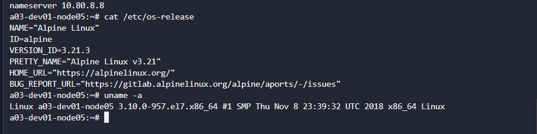
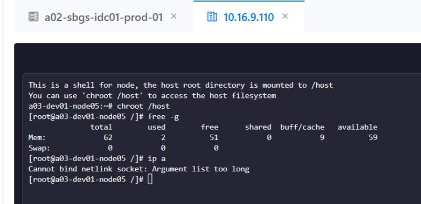
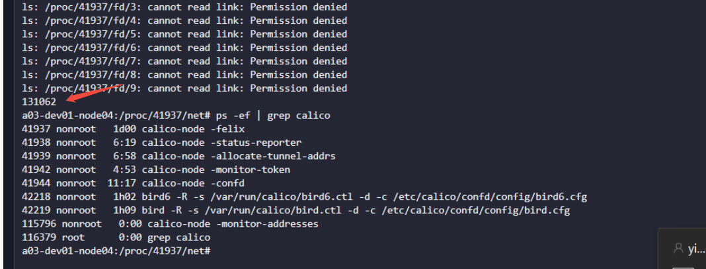

---
kind:
  - Troubleshooting
products:
  - Alauda Container Platform
  - Alauda DevOps
  - Alauda AI
  - Alauda Application Services
  - Alauda Service Mesh
  - Alauda Developer Portal
ProductsVersion:
  - 4.1.0,4.2.x
---
<!-- A type of document that involves encountering a fault, diagnosing it, performing root cause analysis, and providing solutions. -->

# calico  句柄泄漏导致iproute2命令失败

ip a show 出现 Argument list too long

## Cause
- Calico 3.29 版本新增的监控netlink逻辑未释放句柄

## Resolution
- 升级到修复版本 acp v4.0.5 (对应 Calico PR #9612)

## [workaround]

## [Related Information]
**Screenshots**

- Environment: ACP 4.0.2
- calico-node
- felix
- netlink
- iproute2
- /proc/{pid}/fd
- Component: Calico
- Page ID: 343082446
- Original Title: calico  句柄泄漏导致iproute2命令失败
