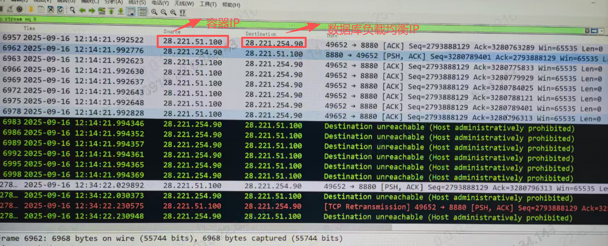
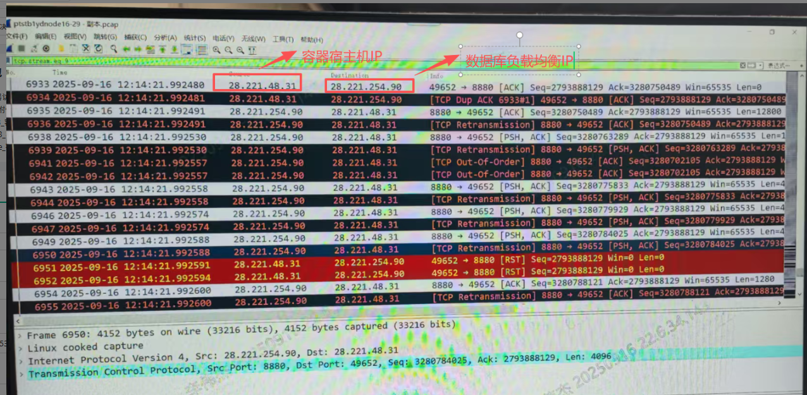
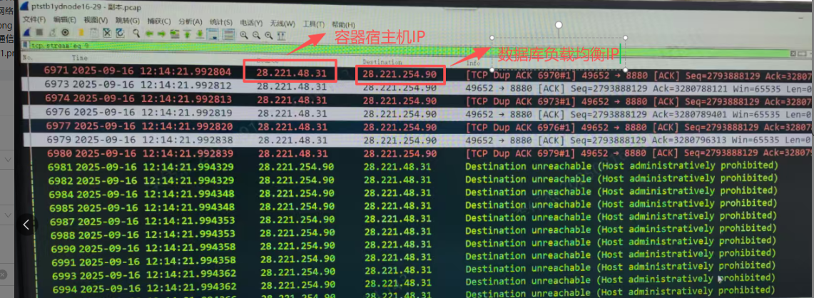

---
kind:
  - Troubleshooting
products:
  - Alauda Container Platform
  - Alauda DevOps
  - Alauda AI
  - Alauda Application Services
  - Alauda Service Mesh
  - Alauda Developer Portal
ProductsVersion:
  - 4.1.0,4.2.x
---
<!-- A type of document that involves encountering a fault, diagnosing it, performing root cause analysis, and providing solutions. -->

# 应用连接集群外数据库，出现异常 RESET/RST

容器访问外部数据库偶现连接超时 宿主机发送RST包后收到destination unreachable报文

## Cause
- 节点内核参数nf_conntrack/ip_conntrack配置问题

## Resolution
- echo 1 > /proc/sys/net/netfilter/nf_conntrack_tcp_be_liberal
- echo 1 > /proc/sys/net/ipv4/netfilter/ip_conntrack_tcp_be_liberal

## [workaround]

## [Related Information]
**Screenshots**

- Environment: CNI: calico
- nf_conntrack_tcp_be_liberal
- ip_conntrack_tcp_be_liberal
- calico
- Component: Calico
- Page ID: 347046127
- Original Title: 应用连接集群外数据库，出现异常 RESET/RST
