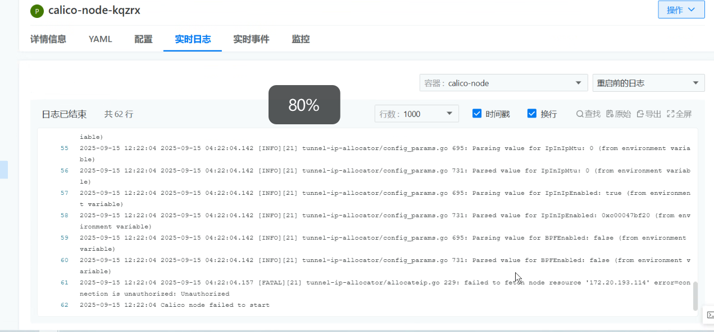

---
kind:
  - Troubleshooting
products:
  - Alauda Container Platform
  - Alauda DevOps
  - Alauda AI
  - Alauda Application Services
  - Alauda Service Mesh
  - Alauda Developer Portal
ProductsVersion:
  - 4.1.0,4.2.x
---
<!-- A type of document that involves encountering a fault, diagnosing it, performing root cause analysis, and providing solutions. -->

# 部分节点calico

部分节点calico-node无法启动 DNSConfigForming: Nameserver limits were exceeded, some nameservers have been omitted 服务组件间认证失败提示无权限

## Cause
- 节点时间不一致导致服务组件间认证失败

## Resolution
- 同步节点时间

## [workaround]

## [Related Information]
**Screenshots**

- Environment: 4.0.1
- Component: Calico
- Page ID: 347439315
- Original Title: 容器平台-网络-其他CNI组件-部分节点calico-node起不来-117670
