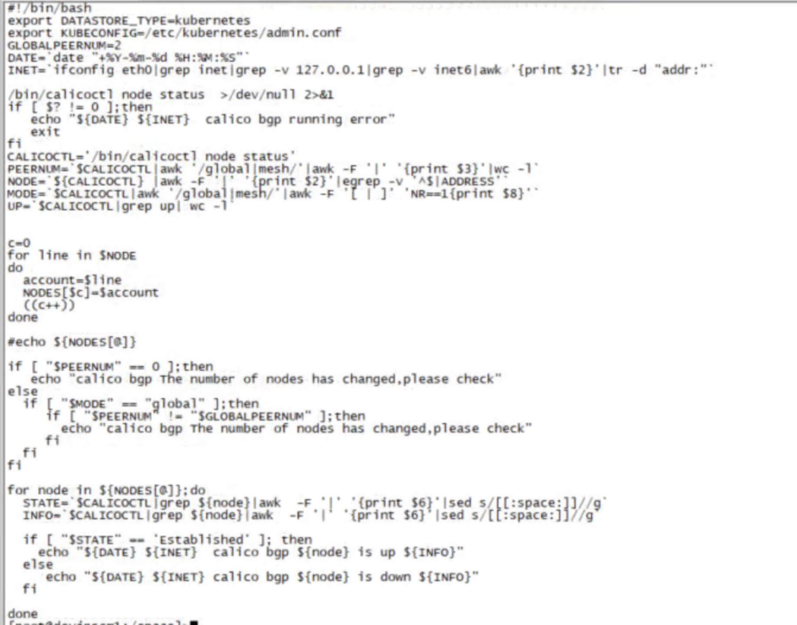
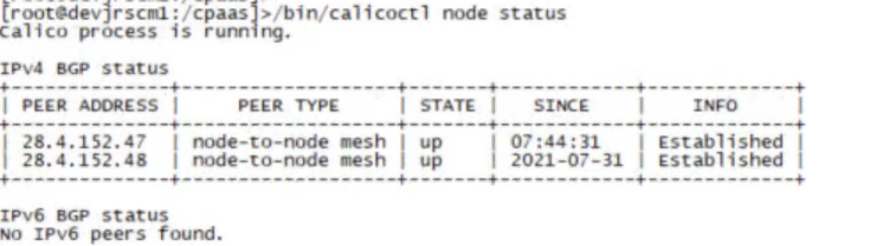
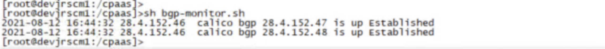
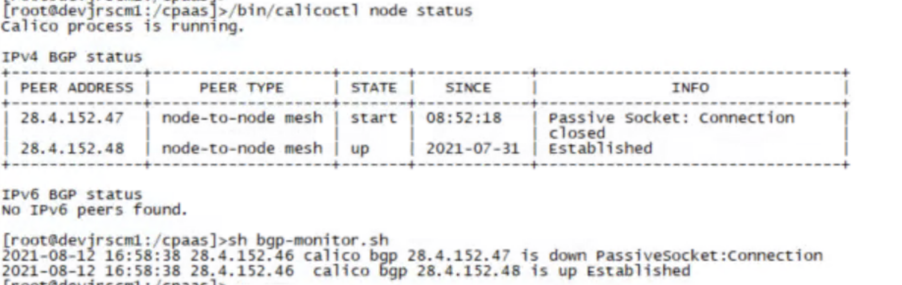
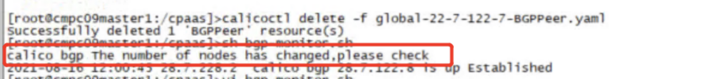
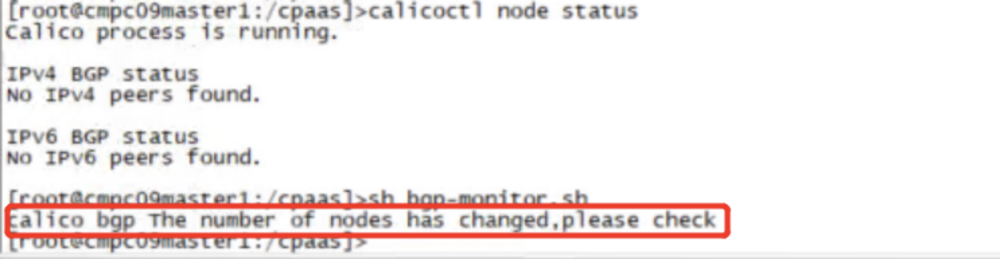
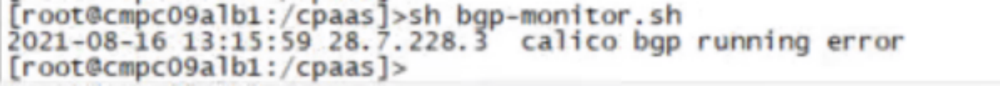

---
kind:
  - Troubleshooting
products:
  - Alauda Container Platform
  - Alauda DevOps
  - Alauda AI
  - Alauda Application Services
  - Alauda Service Mesh
  - Alauda Developer Portal
ProductsVersion:
  - 4.1.0,4.2.x
---
<!-- A type of document that involves encountering a fault, diagnosing it, performing root cause analysis, and providing solutions. -->

# BGP状态监控

BGP状态未处于Established状态 Global Peer被删除 节点处于NotReady状态

## Cause
- acp2.6版本calico未暴露metric指标

## Resolution
- 部署监控脚本到所有节点
- 配置定时任务执行脚本
- 调整脚本中GLOBALPEERNUM值为实际peer数量
- 对接监控平台webhook地址

## [workaround]
- 通过calicoctl node status手动检查BGP状态

## [Related Information]
**Screenshots**

- Environment: acp2.6版本
- calicoctl
- Prometheus
- BGP
- Global Peer
- kubelet
- calico容器
- Component: Calico
- Page ID: 94887585
- Original Title: BGP状态监控
