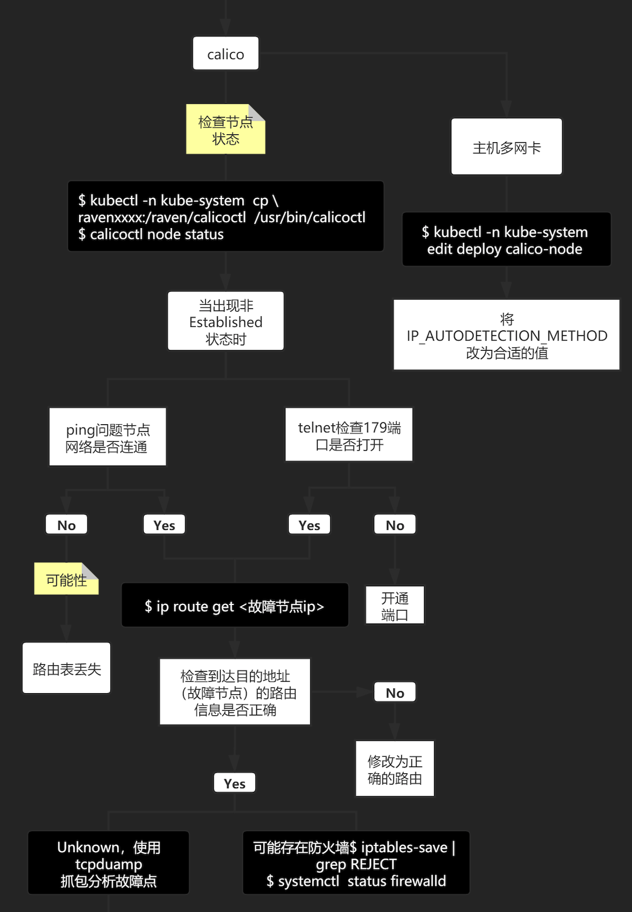
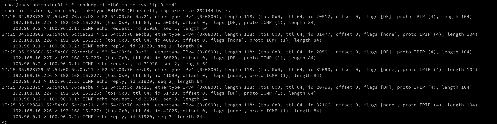

---
kind:
  - Troubleshooting
products:
  - Alauda Container Platform
  - Alauda DevOps
  - Alauda AI
  - Alauda Application Services
  - Alauda Service Mesh
  - Alauda Developer Portal
ProductsVersion:
  - 4.1.0,4.2.x
---
<!-- A type of document that involves encountering a fault, diagnosing it, performing root cause analysis, and providing solutions. -->

# Calico 网络不通常规排查方法

路由不正确（如Pod IP的路由下一跳走默认网关） BGP连接状态非Established 跨节点Ping Pod IP不通

## Cause
- BGP 179端口被限制
- 宿主机多网卡导致BGP使用错误IP
- AS号配置错误
- IPIP协议未开放
- IP_AUTODETECTION_METHOD配置不当

## Resolution
- 检查并开放179端口
- 调整IP_AUTODETECTION_METHOD环境变量（如can-reach或interface）
- 更新calico-node镜像至3.3.3+（针对AS号问题）
- 手动构造IPIP隧道测试连通性
- 检查并修复calico-node Pod状态

## [workaround]
- 节点A：ip tunnel add tunl0 mode ipip; ifconfig tunl0 100.96.0.1 netmask 255.255.255.0; ip route add 100.96.0.2/32 via 192.168.16.227 dev tunl0 onlink
- 节点B：ip tunnel add tunl0 mode ipip; ifconfig tunl0 100.96.0.2 netmask 255.255.255.0; ip route add 100.96.0.1/32 via 192.168.16.226 dev tunl0 onlink

## [Related Information]
**Screenshots**

- Environment: Calico 3.6
- calicoctl
- calico-node DaemonSet
- BGP协议
- IPIP模式
- IP_AUTODETECTION_METHOD
- 端口179
- Component: Calico
- Page ID: 98881134
- Original Title: Calico 网络不通常规排查方法
