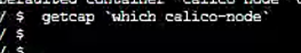
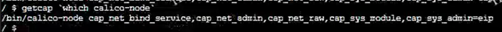

# calico-node 出现 bird: Netlink: Operation not permitted

环境信息
----

操作系统：

内核：

Kubernetes 版本：

CNI 版本：

其他信息：

问题现象
----

某个节点上的 calico-node 异常，日志出现 bird: Netlink: Operation not permitted 以及 ipset/iptables Operation not permitted 报错。

排查步骤
----

检查 calico-node 中 calico-node 的 capabilities，结果为空：

正常节点上非空：

由此可以推断是 docker/containerd 中容器的文件系统缺失了 linux capabilities 属性。

后续排查发现挂载在 /var/lib/containerd 的 LV 卷/XFS 文件系统出现了损坏。

取消 /var/lib/containerd 挂载后，恢复正常。

解决方法
----

修复存储设备/文件系统的故障。后续可能需要将已有的 calico-node 镜像删除，并删除正常运行的 calico-node Pod。

优化措施
----

文档：

测试：

自动化检测：

代码变更：