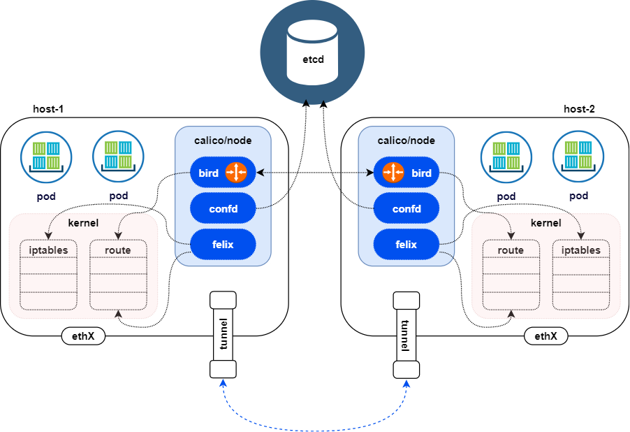
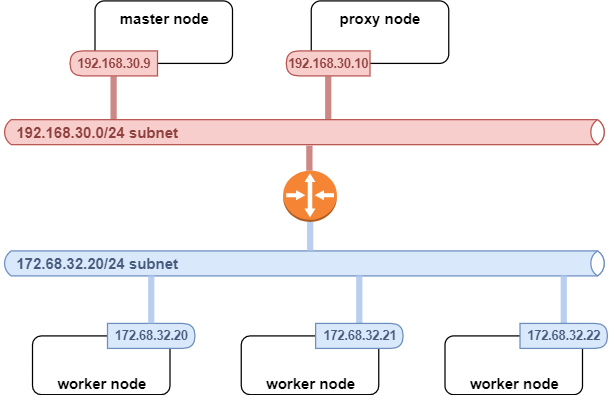

# Calico

## Calico 组件
Calico 具有以下组件：

1. calico/node agent
2. calico/cni
3. calico/kube-controller

## calico/node agent
此实体包含三个组件 - felix、bird 和 confd。

- felix 的主要职责是对于主机的 IPtables 和路径进行编程以提供您所需的来往该主机上的 pod 的连接。
- bird 是面向 Linux® 的开放式源代码 BGP 代理程序，用于在主机之间交换路由信息。由 felix 编程的路径将由 bird 进行选取，以便在集群主机之间进行分发。
- confd 会监视 etcd 数据存储器中对 BGP 配置进行的更改，例如，IPAM 信息、AS 编号等。它还可更改 bird 配置文件，并触发 bird 以在每台主机上重新装入这些文件。calico/node agent 可创建 veth 对，以将 pod 网络名称空间与主机的缺省网络名称空间相连。

## calico/cni
CNI 插件通过为节点中托管的 pod 配置 IP 地址来提供 IP 地址管理 (IPAM) 功能。

## calico/kube-controller
calico/kube-controller 可监视 Kubernetes NetworkPolicy 对象，并使 Calico 数据存储器与 Kubernetes 对象保持同步。每个节点上运行的 calico/node 使用 Calico etcd 数据存储器中的信息来对本地 iptable 进行编程。

## calicoctl
calicoctl 是命令行工具，可用于管理 Calico 网络和安全策略以及其他 Calico 配置。它通过与 etcd 直接通信来处理数据存储器。它可提供多种资源管理命令，并可用于对 Calico 网络问题进行故障诊断。要设置 Calico CLI，请参阅安装 Calico CLI (calicoctl)。

## 跨不同网络分段的 Calico 网络
当节点位于不同网络分段上时，在底层和基础结构网络中通过路由器来连接这些节点。不同子网上的两个节点之间的流量会遍历作为两个子网的网关的路由器。如果路由器未发现 pod 子网，那么将无法在主机之间转发包。

有两种方法可用于处理这种情况：

1. 可将 Calico 配置为针对节点上托管的每个子网在每个节点上创建 IP-in-IP 隧道端点。源自 pod 并且正在离开节点的任何包都将以 IP-in-IP 头进行封装，并且节点 IP 地址将用作为源。借助这种方式，基础结构路由器将无法看到 pod IP 地址。

   由于在每个端点都需要执行额外的包处理以对包进行封装和解封，因此 IP-in-IP 隧道会带来额外的网络吞吐量和延迟。在裸机上，由于可将某些网络操作卸载至网络接口卡，因此开销不明显。但在虚拟机上，开销显著，并且还会受到系统管理器所配置和使用的 CPU 核心数和网络 I/O 技术的影响。如果使用的最大传输单元 (MTU) 大小较小，那么同样可能造成显著的额外包封装开销，因为这样会造成包分段。必须尽可能启用巨型帧。

2. 第二个选项是使基础结构路由器发现 pod 网络。可通过在路由器上启用 BGP 并在集群中添加节点作为 BGP 同级来完成此操作。这些步骤允许路由器和主机在彼此之间交换路由信息。在此场景中，集群大小可发挥与在 BGP mesh 中相同的作用。在路由器上启用 BGP 后，集群中的每个节点都是路由器的同级。