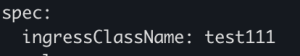
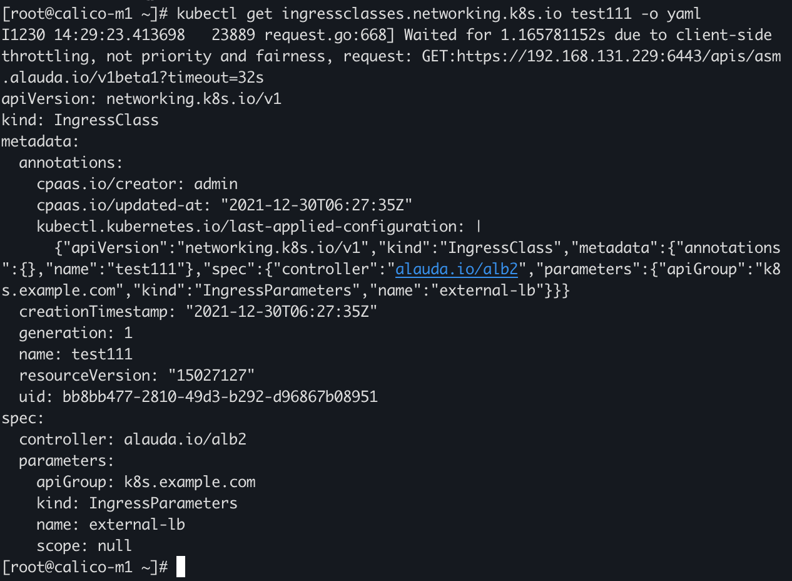
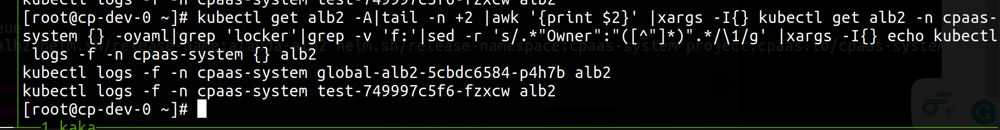
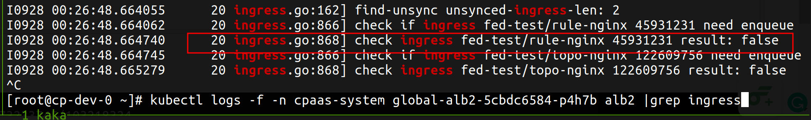
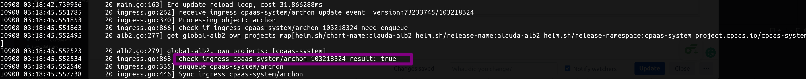

---
kind:
  - Troubleshooting
products:
  - Alauda Container Platform
  - Alauda DevOps
  - Alauda AI
  - Alauda Application Services
  - Alauda Service Mesh
  - Alauda Developer Portal
ProductsVersion:
  - 4.1.0,4.2.x
---
<!-- A type of document that involves encountering a fault, diagnosing it, performing root cause analysis, and providing solutions. -->

# 负载均衡没有同步入站规则ingress排查

负载均衡未同步入站规则 ingress未生成对应的rule alb日志中check ingress的result为false

## Cause
- 项目(project)配置不匹配
- ingress class配置错误
- 端口模式下手动创建了ingress监听端口
- 3.7之前版本ingress名称+ns名称超过63字符

## Resolution
- 确认ingress的Spec.IngressClassName对应IngressClass且controller为<labelBaseDomain>/alb2
- 检查ingress的annotation kubernetes.io/ingress.class是否符合alb2负载均衡名称
- 验证ns标签cpaas.io/project与alb/ft的project是否匹配
- 执行kubectl get rule -n cpaas-system -o yaml |grep ingressname检查rule生成
- 通过kubectl logs -n cpaas-system <alb-pod> alb2 |grep ingress检查同步结果

## [workaround]
- 更新ingress触发同步操作

## [Related Information]
**Screenshots**

- Environment: all
- kubernetes.io/ingress.class
- cpaas.io/project
- IngressClass
- rule资源
- alb2日志
- Component: Ingress NGINX
- Page ID: 108109884
- Original Title: 负载均衡没有同步入站规则ingress排查
