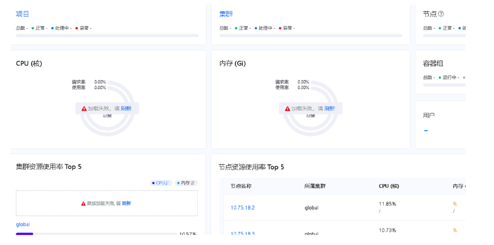
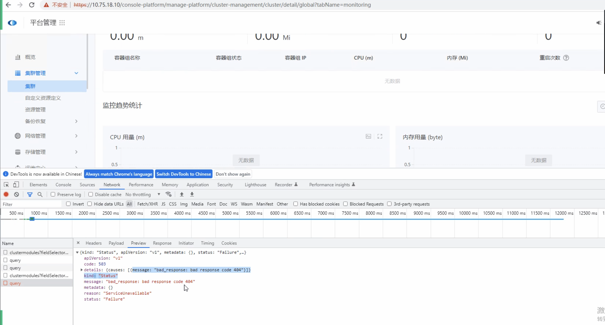
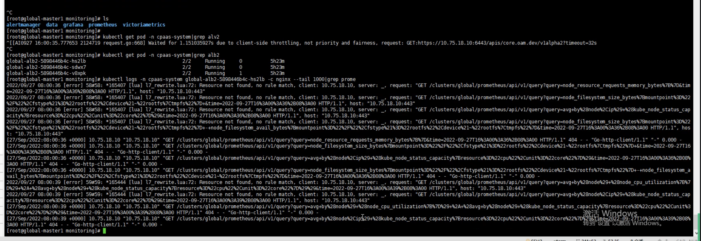
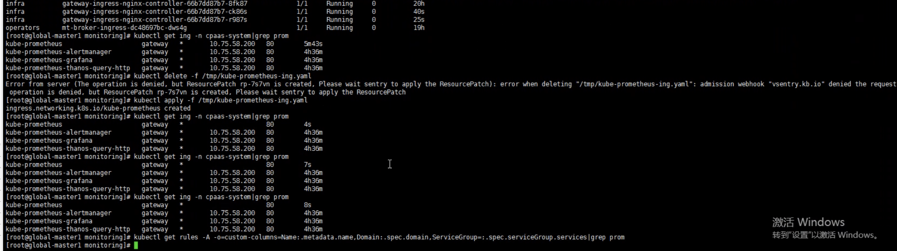

---
kind:
  - Troubleshooting
products:
  - Alauda Container Platform
  - Alauda DevOps
  - Alauda AI
  - Alauda Application Services
  - Alauda Service Mesh
  - Alauda Developer Portal
ProductsVersion:
  - 4.1.0,4.2.x
---
<!-- A type of document that involves encountering a fault, diagnosing it, performing root cause analysis, and providing solutions. -->

# 监控面板无数据

监控面板无数据 Prometheus/Grafana 404错误 ALB访问记录显示no rules match

## Cause
- Prometheus的ingress被客户部署的gateway ingress-controller接管
- gateway被设置为默认ingress控制器

## Resolution
- 修改prometheus ingress的ingressClassName为集群对应alb名称

## [workaround]

## [Related Information]
**Screenshots**

- Environment: 3.8.2
- prometheus ingress
- ingressClassName
- alb
- gateway ingress-controller
- kubectl get rules -A -o=custom-columns=Name:.metadata.name,Domain:.spec.domain,ServiceGroup:.spec.serviceGroup.services
- Component: Ingress NGINX
- Page ID: 127404700
- Original Title: 监控面板无数据
